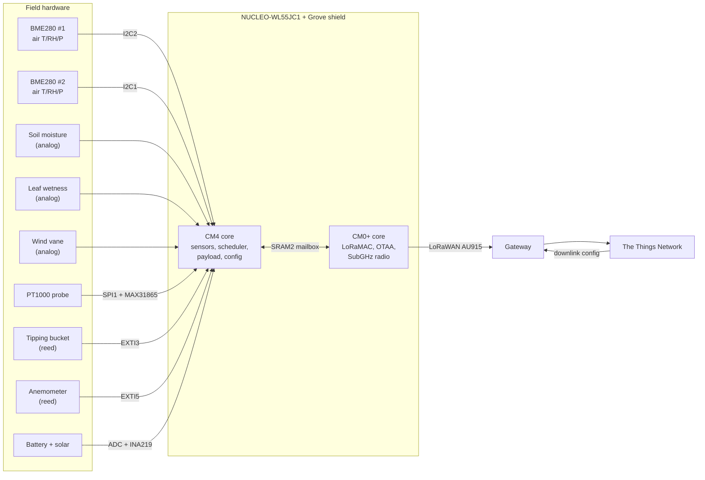
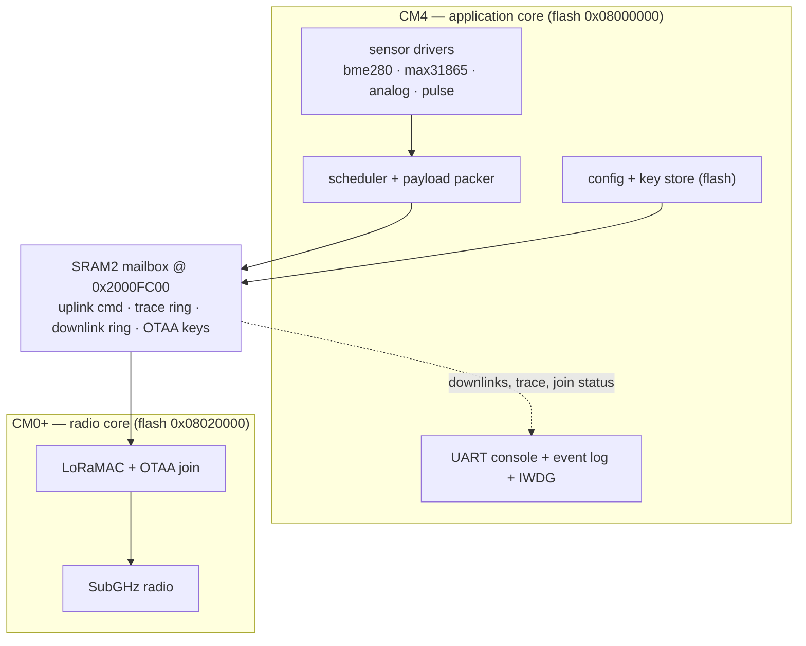

# EnviroNode-WL55 — Build Logbook & Replication Manual

> **What this document is.** The living record of this node: every design
> decision, every procedure, every part, and a dated log of what was done and
> why. It is written so that someone with the parts and this file — and nothing
> else — can **build a second identical node and put it in a field**.
>
> **It is updated on every change.** Whenever firmware, hardware, or design
> changes, the relevant section AND [§14 Build log](#14-build-log) are updated in
> the same edit, then re-checked (see [§0.3](#03-how-this-document-is-maintained)).

| | |
|---|---|
| **Document** | EnviroNode-WL55 Build Logbook & Replication Manual |
| **Revision** | r15 — 2026-08-04 |
| **Node platform** | NUCLEO-WL55JC1 (STM32WL55JC, dual-core) + Seeed Grove Base Shield V2 |
| **Firmware** | `EnviroNode_CM4` (application) + `EnviroNode_CM0PLUS` (radio), v2.5 |
| **Build state** | Both cores build green (clean build, CM4 warning-free) — see [§5](#5-building-and-flashing) |
| **Field state** | **Running on hardware.** Boot, config, STOP2 sleep/wake, console and self-test all verified on the board; sensors not yet wired, no gateway yet. See [§14](#14-build-log) r6 |
| **Repository** | `Hardware/EnviroNode-WL55` (private) |

---

## 0. Using this document

### 0.1 Reading order

| If you want to… | Start at |
|---|---|
| Understand what the node is | [§1 System overview](#1-system-overview) |
| Buy the parts | [§2 Bill of materials](#2-bill-of-materials) |
| Wire a node | [§3 Hardware assembly](#3-hardware-assembly-and-wiring) |
| Get a toolchain and build | [§4](#4-toolchain-and-repository-setup), [§5](#5-building-and-flashing) |
| Understand the firmware | [§6 Firmware architecture](#6-firmware-architecture) |
| Commission a new node on TTN | [§8 Provisioning](#8-provisioning-a-new-node) |
| **Run the first warm test on a new board** | [§11.1 First warm test](#111-first-warm-test-two-bme280s) |
| Operate / configure a live node | [§9 Operating the node](#9-operating-the-node) |
| Decode the uplink | [§10 Payload and decoder](#10-payload-and-ttn-decoder) |
| **Build a second node end-to-end** | [§13 Replication recipe](#13-replication-recipe) |
| Know why something is the way it is | [§15 Decision register](#15-decision-register) |

### 0.2 Companion documents

This logbook is the entry point and the narrative. The normative specifications
live in their own files and are the ground truth when the two ever disagree —
if that happens, fix the logbook.

| Document | Authority over |
|---|---|
| [MASTER.md](MASTER.md) | The thesis-style narrative — descriptive, defers to the specs below |
| [PINOUT.md](PINOUT.md) | Pin and peripheral allocation |
| [PAYLOAD.md](PAYLOAD.md) | Uplink frame bytes, downlink command table |
| [CONFIG.md](CONFIG.md) | The `{…}` sensor-set configuration string |
| [SENSORS.md](SENSORS.md) | Per-sensor driver behaviour and calibration |
| [ARCHITECTURE.md](ARCHITECTURE.md) | Dual-core split, mailbox |
| [ROADMAP.md](ROADMAP.md) | What is done and what is next |
| [../CLAUDE.md](../CLAUDE.md) | Session-continuity rules for contributors |

### 0.3 How this document is maintained

Every change to the project updates this file **in the same commit**:

1. Update the affected section(s).
2. Add a dated entry to [§14 Build log](#14-build-log) — what changed, why, and
   what it means for someone replicating the node.
3. Record any new decision in [§15 Decision register](#15-decision-register).
4. Bump the **Revision** in the header block.
5. **Verify** (this step is not optional):
   - every internal anchor resolves,
   - every companion-document link resolves,
   - every pin, address, constant and command quoted here still matches the
     source file it came from,
   - figure and table numbers are contiguous and match the lists in
     [§0.4](#04-figures-and-tables).

### 0.4 Figures and tables

**Figures**

| # | Title | Section |
|---|---|---|
| 1 | System block diagram | [§1.1](#11-what-the-node-does) |
| 2 | Physical wiring map | [§3.2](#32-wiring-map) |
| 3 | Dual-core firmware split | [§6.1](#61-dual-core-split) |
| 4 | Measurement cycle | [§6.3](#63-measurement-cycle) |
| 5 | CM4 flash layout | [§7](#7-non-volatile-memory-map) |
| 6 | Configuration data flow | [§9.3](#93-configuration-data-flow) |

**Tables**

| # | Title | Section |
|---|---|---|
| 1 | Bill of materials | [§2.1](#21-core-parts) |
| 2 | Sensor parts | [§2.2](#22-sensor-parts) |
| 3 | Arduino header map (NUCLEO-WL55JC1) | [§3.1](#31-board-reference) |
| 4 | Sensor → interface → pin allocation | [§3.2](#32-wiring-map) |
| 5 | Free pins | [§3.3](#33-free-pins) |
| 6 | Toolchain components | [§4.1](#41-required-software) |
| 7 | Firmware module catalogue | [§6.2](#62-module-catalogue) |
| 8 | Flash regions | [§7](#7-non-volatile-memory-map) |
| 9 | Console command reference | [§9.1](#91-console-reference) |
| 10 | Sensor-set keys | [§9.2](#92-sensor-set-configuration-string) |
| 11 | Uplink frame layout | [§10.1](#101-uplink-frame) |
| 12 | Commissioning checklist | [§11.2](#112-commissioning-checklist) |
| 13 | Troubleshooting | [§12](#12-troubleshooting) |
| 14 | Decision register | [§15](#15-decision-register) |
| 15 | External references | [§16](#16-references) |

---

## 1. System overview

### 1.1 What the node does

An agrometeorological sensor node. It wakes on an interval, measures a
configurable set of environmental channels, packs them into a compact binary
frame, and uplinks over LoRaWAN. It accepts downlinks that reconfigure which
sensors run and how often.

**Figure 1 — System block diagram**



### 1.2 Measured channels

| Channel | Sensing element | Config key |
|---|---|---|
| Air temperature / humidity / pressure ×2 | 2 × BME280 on separate I²C buses | `T1`, `T2` |
| Soil moisture | analog probe | `SM` |
| Leaf wetness | resistive grid | `LW` |
| Soil temperature | PT1000 RTD via MAX31865 | `ST` |
| Wind speed + gust | anemometer reed | `WS` |
| Wind direction | vane potentiometer | `WD` |
| Rainfall | tipping-bucket reed | `R` |
| Battery voltage (+ current) | divider + INA219 | always on |

Two BME280s are used on **two separate I²C buses** because both chips answer at
the same address pair (`0x76`/`0x77`) and the pair must be readable
independently. See [D-02](#15-decision-register).

### 1.3 Origin

Migrated from the **KoreroNet 2** acoustic node (same WL55JC1 + LoRaWAN
platform). The radio core, the CM4↔CM0+ mailbox, the OTAA key handling, the UART
command server, the RTC helpers, the event log and the IWDG watchdog were reused
almost unchanged. **The acoustic recording, the AudioMoth control and the entire
Raspberry-Pi power/wake/timetable subsystem were removed** — this node has no
audio, no Pi, and no recording timetable. See [D-01](#15-decision-register).

---

## 2. Bill of materials

> ⚠️ **To confirm as-built.** The rows marked *(confirm)* are the class of part
> the firmware expects; the exact part actually fitted on the first node has not
> been transcribed into this logbook yet. Fill these in from the physical build
> and update the calibration constants in [§11.3](#113-calibration-constants).

### 2.1 Core parts

**Table 1 — Bill of materials (core)**

| Item | Part | Qty | Notes |
|---|---|---|---|
| MCU board | **NUCLEO-WL55JC1** (MB1389, high-band) | 1 | STM32WL55JC, dual-core, integrated SubGHz radio. Region variant must match your gateway band |
| Shield | **Seeed Grove Base Shield V2** | 1 | Provides Grove sockets on the Arduino headers |
| RTD front-end | **MAX31865 breakout** | 1 | **Rref must be 4.02 kΩ** for PT1000 — see [D-05](#15-decision-register) |
| Battery monitor | **INA219** breakout, addr `0x45` | 1 | On the shield I²C bus; 0.1 Ω shunt |
| Battery | LiFePO₄ **4S**, ~12 Ah *(confirm)* | 1 | Thresholds in `pins_config.h` assume 4S LiFePO₄ |
| Solar + charger | *(confirm)* | 1 | Sized in Phase 6 |
| Battery divider | 56.06 kΩ / 14.711 kΩ *(confirm — measured values)* | 1 | Gain ≈ 4.748, `VBAT_DIVIDER_GAIN` |
| I²C pull-ups | 4.7 kΩ ×4 | — | Needed on **both** buses; most BME280 breakouts include them |
| Programmer | On-board ST-LINK (USB) | 1 | Also the console (VCP) |

### 2.2 Sensor parts

**Table 2 — Bill of materials (sensors)**

| Measurement | Part class | Interface | Firmware expects |
|---|---|---|---|
| Air T/RH/P ×2 | **BME280** breakout ×2 | I²C | chip id `0x60`, addr `0x76` or `0x77` (auto-probed) |
| Soil moisture | capacitive or resistive probe *(confirm)* | analog 0–3.3 V | raw 12-bit counts; curve applied off-node |
| Leaf wetness | **Decagon Devices LWS** (METER; successor **PHYTOS 31**) — dielectric, 3-wire analog | analog into **A0**, excite from **3V3** | raw 12-bit counts; full spec in [SENSORS.md §4](SENSORS.md) |
| Soil temperature | **PT1000** RTD probe, 2/3/4-wire | via MAX31865 | `MAX31865_RTD_NOMINAL = 1000`, wire count set in firmware |
| Wind speed | anemometer, reed/hall pulse *(confirm)* | dry contact to GND | `ANEMO_MS_PER_HZ` (default 0.34) |
| Wind direction | vane potentiometer *(confirm)* | analog 0–3.3 V | linear 0–360°, plus north offset |
| Rainfall | tipping bucket, reed *(confirm)* | dry contact to GND | `RAIN_MM_PER_TIP` (default 0.2794 mm) |

---

## 3. Hardware assembly and wiring

### 3.1 Board reference

The Arduino header mapping of the NUCLEO-WL55JC1 is the foundation of every
wiring decision below. It was verified against **UM2592 Table 17** [[R1]](#16-references)
and cross-checked against the mbed board definition [[R2]](#16-references) and the
CubeMX MCU database [[R3]](#16-references).

**Table 3 — NUCLEO-WL55JC1 Arduino header map**

| Arduino | MCU pin | | Arduino | MCU pin | | Arduino | MCU pin |
|---|---|---|---|---|---|---|---|
| A0 | PB1 (ADC_IN5) | | D0 | PB7 | | D8 | PC2 |
| A1 | PB2 (ADC_IN4) | | D1 | PB6 | | D9 | PA9 |
| A2 | PA10 (ADC_IN6) | | D2 | PB12 | | D10 | PA4 (SPI1_NSS) |
| A3 | PB4 (ADC_IN3) | | D3 | PB3 | | D11 | PA7 (SPI1_MOSI) |
| A4 | PB14 (ADC_IN1) | | D4 | PB5 | | D12 | PA6 (SPI1_MISO) |
| A5 | PB13 (ADC_IN0) | | D5 | PB8 | | D13 | PA5 (SPI1_SCK) |
| | | | D6 | PB10 | | D14 | PA11 (**I²C2_SDA**) |
| | | | D7 | PC1 | | D15 | PA12 (**I²C2_SCL**) |

> ⚠️ **Documentation trap.** UM2592 labels D14/D15 as "I2C1_SDA / I2C1_SCL", but
> on the STM32WL55 those pins (PA11/PA12) are **I²C2**. ST has acknowledged the
> error [[R4]](#16-references). Everything on the Grove shield's four I²C sockets is
> therefore on **I²C2**. Getting this wrong is the single most likely way to lose
> a day on a replica build.

### 3.2 Wiring map

**Table 4 — Sensor → interface → pin allocation** (normative copy: [PINOUT.md](PINOUT.md))

| Sensor | Interface | Pins | Where it plugs in |
|---|---|---|---|
| BME280 #1 (`T1`) | I²C2 | PA12 SCL / PA11 SDA | Any Grove **I²C** socket on the shield |
| BME280 #2 (`T2`) | I²C1 | PA9 SCL / PA10 SDA | Hand-wired to D9 + A2 |
| Leaf wetness (`LW`) — **Decagon LWS** | ADC_IN5 | PB1 | **A0** (Grove A0 socket) |
| Soil moisture (`SM`) | ADC_IN4 | PB2 | A1 |
| Wind direction (`WD`) | ADC_IN3 | PB4 | A3 |
| Battery divider | ADC_IN1 | PB14 | A4 |
| Soil temp (`ST`) | SPI1 + CS | PA5/PA6/PA7 + PA4 | D13/D12/D11 + D10 |
| Rain (`R`) | EXTI3, pull-up | PB3 | Grove **"D3"** socket, pin 1 |
| Wind speed (`WS`) | EXTI5, pull-up | PB5 | Grove **"D3"** socket, pin 2 |
| Battery V/I | I²C2 | PA12/PA11 | Grove I²C socket, addr `0x45` |
| Status LED | GPIO out | PC2 | D8 |
| Console | USART2 → ST-LINK VCP | PA2/PA3 | USB |
| Aux console | USART1 | PB6/PB7 | D1/D0 |
| RF front-end | **do not touch** | PC3/PC4/PC5 | on-board switch control |

**Figure 2 — Physical wiring map**

```
                    NUCLEO-WL55JC1 + Grove Base Shield V2
   ┌───────────────────────────────────────────────────────────────┐
   │  Grove I2C  ×4 ──── PA12/PA11 (I2C2) ──── BME280 #1 + INA219  │
   │  Grove "D3"    ──── PB3 (D3) rain reed                        │
   │                └─── PB5 (D4) anemometer reed  [one 4-pin cable]│
   │  A0 PB1 ─── soil moisture       A1 PB2 ─── leaf wetness       │
   │  A3 PB4 ─── wind vane           A4 PB14 ── battery divider    │
   │  D13/D12/D11 + D10 ──── MAX31865 ──── PT1000 probe            │
   │  D9 PA9 + A2 PA10 (I2C1) ──── BME280 #2   [hand-wired]        │
   │  D8 PC2 ─── status LED                                        │
   │  FREE: D2 (PB12), D5 (PB8), D6 (PB10), D7 (PC1), A5 (PB13)    │
   └───────────────────────────────────────────────────────────────┘
```

**Wiring procedure**

1. Fit the Grove Base Shield to the Arduino headers.
2. Plug **BME280 #1** into any Grove I²C socket. Confirm its address strap
   (`0x76` or `0x77`) — either works, the driver probes both.
3. Hand-wire **BME280 #2**: SCL→D9 (PA9), SDA→A2 (PA10), 3V3, GND. Add 4.7 kΩ
   pull-ups to 3V3 on both lines **unless the breakout already has them**.
4. Plug the **INA219** into a second Grove I²C socket; set its address to `0x45`.
5. Wire the **MAX31865** to D13 (SCK), D12 (MISO), D11 (MOSI), D10 (CS), 3V3,
   GND. Confirm the board carries a **4.02 kΩ** Rref, not the 430 Ω PT100 part —
   many breakouts ship as PT100. Wire the PT1000 probe per its wire count and set
   the matching mode in firmware (`ENVNODE_RTD_WIRES`).
6. Wire the **rain** reed to D3 and the **anemometer** reed to D4, commons to
   GND. Both are dry contacts; the MCU supplies the pull-up. One 4-pin Grove
   cable in the "D3" socket carries both.
7. Wire the analog probes to A0 (soil), A1 (leaf), A3 (vane), each referenced to
   the board's GND, and the battery divider output to A4.
8. Do **not** connect anything to PC3/PC4/PC5 — they drive the RF switch.

### 3.3 Free pins

**Table 5 — Pins available for future sensors**

| Pin | Arduino | Note |
|---|---|---|
| PB12 | D2 | free |
| PB8 | D5 | free |
| PB10 | D6 | freed when the Pi wake line was removed |
| PC1 | D7 | freed when the Pi 5 V enable was removed |
| PB13 | A5 (ADC_IN0) | free analog channel |
| PA15, PA0, PA1, PA8, PB15, PC0, PC6 | — | not on the Arduino headers |

---

### 3.4 Component and placement summary (the assembly bill)

Everything that gets fitted, and exactly where. Pins are the MCU pin with the
Arduino label the silkscreen prints.

**Boards**

| # | Part | Fits where | Notes |
|---|---|---|---|
| B1 | NUCLEO-WL55JC1 | — | ST-LINK USB is power + console (115200 8N1) |
| B2 | Grove Base Shield V2 | onto the Arduino headers | ⚠️ **selector at 3.3 V** — it sets VCC on every socket |

**On I²C2 — the shield's Grove I²C sockets (PA12 SCL / PA11 SDA)**

| # | Part | Address | Fits where |
|---|---|---|---|
| U1 | BME280 #1 → `T1` | 0x76 **or** 0x77 | any Grove **I²C** socket |
| U2 | **INA219** battery monitor | **0x45** = bridge **both** A0 and A1 jumpers | a second Grove **I²C** socket |

**INA219 wiring — it is a high-side current sensor, so the shunt goes in the battery line:**

```
battery + ──→ VIN+ ─[0.1 Ω shunt on the breakout]─ VIN− ──→ node + all loads
battery − ──────────────── common GND ─────────────────────→ node GND
VCC → 3V3 (Grove socket)      SDA/SCL → Grove socket
```
Bus voltage is read at VIN− against GND (the 0.1 Ω drop is ~10 mV at 100 mA, i.e.
noise). Max bus 26 V, so a 4S LiFePO₄ at 13–14.6 V is well inside range. The
firmware treats **charging as negative current** (`CHARGE_NEGATIVE_CURRENT_A`), so
if the sign comes out inverted either swap VIN+/VIN− or flip it in software.

**On I²C1 — hand-wired to board pins**

| # | Part | Fits where |
|---|---|---|
| U3 | BME280 #2 → `T2` | SCL → **D9** (PA9), SDA → **A2** (PA10), VCC → 3V3, GND |

**Sensors**

| # | Part | Signal to | Power from | Extra parts |
|---|---|---|---|---|
| S1 | Decagon **LWS** leaf wetness → `LW` | **A0** (PB1) — *red* wire (LWS) / *orange* (PHYTOS 31) | **VSENS**, not socket VCC | — |
| S2 | **Davis 7911** direction → `WD` | **A3** (PB4) — *green* (wiper) | **VSENS** — *yellow* | **R2 1 MΩ** A3→GND |
| S3 | **Davis 7911** speed → `WS` | **A4** (PB14) — *black* (contact), **ADC, burst-sampled** | — (switch to GND, *red*) | **R1 47 kΩ** A4→3V3 — **required**, the internal pull-up is unavailable on an analog pin |
| S4 | Rain tipping bucket → `R` | **D3** (PB3) | — (switch to GND) | internal pull-up; 10 kΩ + 100 nF optional |
| S5 | MAX31865 + PT1000 → `ST` | SCK **D13**, MISO **D12**, MOSI **D11**, CS **D10** | 3V3 | **Rref must be 4.02 kΩ** (PT1000, not 430 Ω) |
| S6 | Soil moisture → `SM` *(future)* | **A1** (PB2) | VSENS | per probe |
| — | Status LED | **D8** (PC2) | — | ~1 kΩ series |

**Discretes — the small protoboard**

| # | Part | Fits where | Why |
|---|---|---|---|
| Q1 | **P-MOSFET** DMG2301L / AO3401 *(or NPN+PNP)* | source→3V3, gate→**D4** (PB5), drain→**VSENS** | gates LWS + vane excitation; see [PINOUT.md](PINOUT.md) for both circuits |
| R3 | 100 kΩ | Q1 gate → 3V3 | holds the rail OFF while the MCU is in reset |
| R1 | **47 kΩ** | **A4** → 3V3 | pull-up for the speed contact. **Required** — A4 is an ADC input, so there is no internal pull-up |
| R2 | **1 MΩ** | **A3** → GND | pins the vane's dead band to 0 V = north. **100 kΩ would cost ~17°** |
| C1 | 100 nF *(optional)* | **A4** → GND | RC debounce ~1 ms |
| R4/R5 | 4k7 + 10 kΩ | only if using the **NPN+PNP** variant | base drive |
| — | 4.7 kΩ ×2 per I²C bus | SDA/SCL → 3V3 | most breakouts already have them; the shield adds none |

**Deliberately NOT fitted**

| Item | Why |
|---|---|
| Battery divider on **A5** (PB13) | the INA219 supersedes it, and 56 k + 14.7 k across ~13 V leaks ~184 µA ≈ 4.4 mAh/day. Leave A5 free. The firmware keeps it as a fallback and simply reads 0 V when absent |
| Any transistor on a sensor **ground** | a low-side switch lifts the ground by Vce(sat) and corrupts every ground-referenced analog reading ([§15 D-19](#15-decision-register)) |

**Free after all of the above:** `PB8` (D5) · `PB12` (D2) · `PB13` (A5) ·
`PB10` (D6) · `PC1` (D7) · `PA15` · `PA0` · `PA1` · `PA8` · `PB15` · `PC0` · `PC6`.

## 4. Toolchain and repository setup

### 4.1 Required software

**Table 6 — Toolchain**

| Component | Version used | Path on the reference machine |
|---|---|---|
| STM32CubeCLT | 1.19.0 | `C:\ST\STM32CubeCLT_1.19.0` |
| arm-none-eabi-gcc | 13.3.1 (bundled) | `…\GNU-tools-for-STM32\bin` |
| CMake + Ninja | bundled | `…\CMake\bin`, `…\Ninja\bin` |
| STM32_Programmer_CLI | bundled | `…\STM32CubeProgrammer\bin` |
| STM32Cube FW_WL | **V1.3.1** | `C:\Users\<you>\STM32Cube\Repository\STM32Cube_FW_WL_V1.3.1` |

> The HAL sources vendored into this repository are from **FW_WL V1.3.1**. If you
> add a HAL module, copy it from that exact package — mixing HAL versions inside
> one image is a slow, confusing failure mode. Verified by byte-comparing
> `stm32wlxx_hal_i2c.c` and `stm32wlxx_hal.h` against both 1.3.1 and 1.4.0.

> **No CubeMX / no `.ioc`.** Peripheral init is hand-written in `i2c.c`, `spi.c`,
> `adc.c`, `gpio.c`. Generating an `.ioc` would overwrite them. See
> [D-03](#15-decision-register).

### 4.2 Repository layout

```
EnviroNode-WL55/
├── CLAUDE.md                     session-continuity brief for contributors
├── README.md
├── docs/                         ← this logbook and the specifications
├── CM0/EnviroNode_CM0PLUS/       radio core (LoRaMAC, OTAA, SubGHz)
└── CM4/EnviroNode_CM4/           application core
    ├── flash.ps1                 build + flash driver script
    ├── CMakeLists.txt, cmake/vscode_generated.cmake   ← source list lives here
    ├── STM32WL55JCIX_FLASH.ld    linker script (reserves the NVM pages)
    └── Core/WL55JC1/{Inc,Src}/   application + drivers
        └── sensors/              sensor drivers + payload codec
```

---

## 5. Building and flashing

All commands run from `CM4/EnviroNode_CM4/` in **PowerShell**. `flash.ps1` puts
the CubeCLT tools on `PATH` itself — `cmake` is not otherwise available.

**Procedure 5.1 — Build both cores (no hardware needed)**

```powershell
.\flash.ps1 -Build -NoFlash
```

Expected tail:

```
==> Building CM0+ (Debug)...
==> Building CM4 (Debug)...
[N/N] Linking C executable EnviroNode_CM4.elf
==> Build only (skipping flash).
```

Linker warnings about `_close`, `_fstat`, `_getpid`, `_isatty`, `_kill`,
`_lseek`, `_read`, `_write` "not implemented" are **normal** — newlib syscalls
that this firmware never calls.

**Procedure 5.2 — Build and flash both cores**

```powershell
.\flash.ps1 -Build            # build, then program both cores over ST-LINK
.\flash.ps1                   # flash the existing build
.\flash.ps1 -Core cm4 -Build  # one core only (cm0 | cm4 | both)
```

The two ELFs carry their own load addresses: CM4 → `0x08000000`, CM0+ →
`0x08020000`.

**Procedure 5.3 — Board that will not connect**

`flash.ps1` uses connect-under-reset by default. For a board with a flaky NRST,
or one at read-protection level 1:

```powershell
& "C:\ST\STM32CubeCLT_1.19.0\STM32CubeProgrammer\bin\STM32_Programmer_CLI.exe" `
    -c port=SWD mode=HOTPLUG -d .\build\Debug\EnviroNode_CM4.elf -rst
```

If read-protected, regress RDP with the board powered from the ST-LINK USB only.

**Procedure 5.4 — Check the image still clears the reserved flash pages**

```powershell
$B = "C:\ST\STM32CubeCLT_1.19.0\GNU-tools-for-STM32\bin"
& "$B\arm-none-eabi-size.exe" .\build\Debug\EnviroNode_CM4.elf
& "$B\arm-none-eabi-objdump.exe" -h .\build\Debug\EnviroNode_CM4.elf
```

`objdump -h` lists `.bss`/`._user_heap_stack` with a load address too, but those
are `ALLOC`-only and never programmed. For the extent that is actually written,
read the program headers instead — the answer is the end of the last `LOAD`
segment with a non-zero *FileSiz*:

```powershell
& "$B\arm-none-eabi-readelf.exe" -l .\build\Debug\EnviroNode_CM4.elf
```

The highest load address must stay **below `0x0801F000`** — see [§7](#7-non-volatile-memory-map).
Measured at r4: the last programmed byte is at `0x0801760F` (image ends
`0x08017610` = 95,760 B = **93.5 KB** of the 124 KB region, 38.5 KB spare).
The linker enforces this independently — `FLASH` is declared 124K, so an image
that grew into page 62 would fail to link rather than silently overwrite config.

---

## 6. Firmware architecture

### 6.1 Dual-core split

**Figure 3 — Dual-core firmware split**



CM4 owns every application peripheral. CM0+ owns only the radio and is reused
essentially unchanged from KoreroNet. They communicate through a fixed 1 KB
structure in SRAM2 (`korero_mailbox.h`), which **must stay byte-identical in both
projects**.

Verified behaviour that a replica depends on: CM0+ honours `mb->port`, so the
sensor frame really is transmitted on FPort 1 (`lora_app.c`, `TxPayloadPort`).

### 6.2 Module catalogue

**Table 7 — Firmware modules (CM4)**

| Module | Responsibility |
|---|---|
| `main.c` | boot, clock, console command server, scheduler, mailbox service |
| `i2c.c` / `spi.c` / `adc.c` / `gpio.c` | hand-written peripheral init (no CubeMX) |
| `sensors/bme280.{h,c}` | BME280 probe, calibration load, forced-mode read, Bosch compensation |
| `sensors/max31865.{h,c}` | PT1000 front-end: bias→one-shot→read→bias-off, CVD + sub-zero |
| `sensors/analog_sensors.{h,c}` | 4 ADC channels, averaging, divider/vane scaling |
| `sensors/pulse_counter.{h,c}` | debounced rain/wind edge counting, 3 s gust buckets |
| `sensors/envnode_sensors.{h,c}` | fan-out: sample every selected sensor into one struct |
| `sensors/envnode_payload.{h,c}` | uplink packer, downlink command table, config-string entry |
| `envnode_sensorset.{h,c}` | the `{…}` configuration-string grammar and model |
| `envnode_config.{h,c}` | runtime config + its flash page |
| `envnode_keystore.{h,c}` | LoRaWAN identity in flash (survives power loss) |
| `ina219.c`, `battery_adc.c`, `battery_flow.c` | battery voltage / current / coulomb counting |
| `korero_mailbox.h` | shared CM4↔CM0+ structure (identical copy on CM0+) |

### 6.3 Measurement cycle

**Figure 4 — Measurement cycle**

```
 interval elapsed (default 15 min)
        │
        ▼
 sample every SELECTED sensor ──► pack 30-byte FPort-1 frame
        │                                  │
        │                                  ▼
        │                       post to mailbox, bump req_seq
        │                                  │
        ▼                                  ▼
 rain/wind counters reset          CM0+ transmits (FPort 1)
                                           │
                                           ▼
                                  drain downlink ring
                                           │
                                  ┌────────┴────────┐
                                  ▼                 ▼
                        "{…}" config string   binary FPort-10 cmd
                                  └────────┬────────┘
                                           ▼
                                    apply + persist
```

Rain and wind are **event-driven** — their ISRs accumulate between cycles.
Everything else is sampled at the top of the cycle.

---

### 6.4 Sleep and power

Between cycles the CM4 application core is stopped in **STOP2** and woken by the
**RTC wake-up timer**, which runs from the LSE and keeps counting while the core
is off (`envnode_power.c`). Three hazards are handled explicitly, and each is the
reason a naive implementation misbehaves:

| Hazard | Consequence if ignored | What the firmware does |
|---|---|---|
| The IWDG keeps running in STOP2 and cannot be stopped | a sleep longer than ~15 s resets the node | sleeps in **8 s chunks**, refreshing the watchdog between them — so the node stays watchdog-protected while it sleeps |
| `HAL_GetTick()` freezes (SysTick stops with the core) | every tick-based deadline in the firmware drifts by the sleep duration | the elapsed time is **added back to the HAL tick** on wake |
| Rain and wind-speed are counted from GPIO edges with millisecond timestamps | tips are missed and the gust window is corrupted | selecting `R` or `WS` **blocks sleeping**, and the node says so |
| STOP2 leaves the device on MSI with HSI off | UART/I²C/SPI run at the wrong rate after wake | `SystemClock_Config()` re-runs on every wake |

The awake window each cycle is ~10 s after a transmission: a Class A device can
only receive in the RX1/RX2 windows that follow its own uplink, and CM4 must be
awake afterwards to drain what CM0+ received. That window doubles as the
operator's chance to type a command.

**Dual-core caveat, stated honestly.** On the STM32WL each core requests low
power for itself and the *system* only reaches Stop when both have. This code
stops the CM4 core; how deep the whole device goes also depends on what CM0+ is
doing, which is idle between RX windows but is not under CM4's control. Measured
current draw is still an open item — see [§11.2](#112-commissioning-checklist).

**Power design considerations** (ordered by expected benefit; ✅ = implemented):

| | Measure | Status |
|---|---|---|
| ✅ | Stop the core between cycles instead of busy-waiting | done — this section |
| ✅ | Sample on demand rather than continuously: BME280 in **forced mode**, MAX31865 **one-shot with VBIAS off** between reads (which also stops the RTD self-heating the soil it measures) | done — [§15 D-08](#15-decision-register) |
| ✅ | Never write flash on a timer; only on an explicit config change, and only when the value actually changed | done |
| ✅ | Longer interval = proportionally less energy; the interval is remotely settable 1–999 min | done |
| ✅ | Gate the sensor excitation rails so probes draw nothing between samples | firmware done (VSENS on D4, 15 ms pulse); **needs the high-side switch fitted** — [PINOUT.md](PINOUT.md) |
| ☐ | Gate or drop the battery divider — 56 k + 14.7 k across ~13 V leaks ~184 µA ≈ 4.4 mAh/day, and the INA219 is the primary source anyway | not addressed |
| ☐ | Drop the status LED, or make its duty cycle configurable | LED is already brief low-duty pulses; not yet configurable |
| ☐ | Measure and publish an actual current profile (sleep, sample, TX peak) | **open — do this during the first warm test** |
| ☐ | Lower the LoRa data rate / TX power once link margin is known | untouched; ADR is the radio core's business |

## 7. Non-volatile memory map

Two flash pages are reserved so that a node keeps its identity and its
configuration through a power cut, and through a firmware re-flash.

**Figure 5 — CM4 flash layout**

```
0x08000000 ┌────────────────────────────────┐
           │ CM4 application (FLASH = 124K) │  93.5 KB used at r4
0x0801F000 ├────────────────────────────────┤
           │ page 62 — node configuration   │  envnode_config.c
0x0801F800 ├────────────────────────────────┤
           │ page 63 — LoRaWAN identity     │  envnode_keystore.c
0x08020000 ├────────────────────────────────┤
           │ CM0+ radio firmware            │
0x08040000 └────────────────────────────────┘
```

**Table 8 — Reserved flash regions**

| Page | Address | Contents | Written when |
|---|---|---|---|
| 55–61 | `0x0801B800` | **offline sensor log** — 357 timestamped frames, ring | every measurement cycle |
| 62 | `0x0801F000` | sensor set, interval, calibration offsets, vane offset | an accepted config change |
| 63 | `0x0801F800` | AppKey, DevEUI, JoinEUI *(node id planned — [§14](#14-build-log))* | provisioning only |

Both pages are held outside the image by `STM32WL55JCIX_FLASH.ld` (`FLASH` is
declared as **124K**, not 128K). They are **separate pages on purpose**: a flash
page must be erased before rewriting, and a config save must never be able to
take the OTAA identity with it. See [D-07](#15-decision-register).

`flash.ps1` only erases the sectors the ELF covers, so **re-flashing the
application preserves both pages** — a node keeps its keys and its configuration
across a firmware update.

> ⚠️ **Timing hazard.** Erasing a flash page stalls instruction fetches for the
> *other* core too, for roughly 20–40 ms. Config is therefore written only on an
> explicit command, never on a timer and never inside a LoRaWAN RX window.

---

### 7.1 Where the LoRaWAN identity lives

A node looks for its OTAA identity in three places, in this order, and always
ends up with *something* — it never sits silent waiting to be provisioned:

| Order | Store | Survives | Set by |
|---|---|---|---|
| 1 | **RTC backup registers** | any reset; a power cut only while VBAT is held up | `nucleo lorawan appkey …` |
| 2 | **Flash page 63** | any power loss, and an application re-flash | the same command (mirrored automatically) |
| 3 | **Compiled-in default** — `Core/WL55JC1/Src/envnode_identity.c` | rebuilds | editing that file |

`info` reports which one is in use (`Key store : …`). The compiled-in AppKey is a
deliberately recognisable placeholder (the FIPS-197 AES test vector) so nobody
mistakes it for a secret — replace it, either by editing `envnode_identity.c` for
a whole batch, or per node over the console, which is the normal fleet workflow.

The compiled-in DevEUI is **all-zero on purpose**: that means "use the DevEUI the
radio core derives from the STM32's unique device ID", which is already unique
per board and needs no provisioning. `info` prints the one actually in use, and
that is what you register on TTN.

`nucleo lorawan forget` clears both stored copies and reverts to the compiled-in
identity immediately (no reset needed).

### 7.2 VBAT and the backup registers

The backup registers are the fast path for the keys, but on a stock
NUCLEO-WL55JC1 **`SB21` ties VBAT to VDD**, so they die with the main supply —
which is exactly why the flash mirror exists.

If you fit a coin cell: **remove SB21** and feed VBAT from the cell. Then the
backup registers (and the RTC's date/time) survive a full power cut, which buys:

- the RTC keeps real time across power loss, so log timestamps stay meaningful;
- key restore comes from backup registers rather than flash, so page 63 is only
  ever written when someone actually provisions a node;
- twenty 32-bit backup registers become genuinely non-volatile scratch.

The firmware needs no change for this — it already prefers backup registers and
falls back to flash — but `info` will start reporting
`flash + backup registers` where it previously said `flash` after a power cut.
Record on the node's build sheet whether SB21 was removed, because it changes
what a "power-cycle test" is actually proving.

## 8. Provisioning a new node

**Procedure 8.1 — Register the node on TTN**

1. Flash the firmware ([§5](#5-building-and-flashing)) and open the ST-LINK VCP
   at **115200 8N1**.
2. Type `info`. Record the **DevEUI** it prints (the radio core derives it from
   the chip's unique ID, so it is unique per board before any provisioning).
3. In the TTN console create an end device: **manual registration**, LoRaWAN
   **1.0.x**, region matching your gateway (**AU915, sub-band FSB2** for the
   reference deployment).
4. Enter the DevEUI from step 2. Use `0000000000000000` as the JoinEUI/AppEUI
   unless your network requires otherwise. Let TTN generate an **AppKey**.

**Procedure 8.2 — Load the keys into the node**

```
nucleo lorawan appkey <32 hex chars>
nucleo lorawan deveui <16 hex chars>      # only if overriding the chip DevEUI
```

The keys are written to the RTC backup registers **and mirrored to flash page
63**, then the radio core re-joins. Confirm with `info`:

```
Key store : flash + backup registers
Joined    : yes
```

> Backup registers alone are not enough: on this board VBAT rides VDD, so a flat
> battery clears them. The flash mirror is what makes the identity survive a real
> power cut. See [D-06](#15-decision-register).

**Procedure 8.3 — Set the measurement configuration**

```
nucleo set {T1,T2,SM,ST,LW,WS,WD,R,15}
```

See [§9.2](#92-sensor-set-configuration-string) and [CONFIG.md](CONFIG.md).

---

## 9. Operating the node

### 9.1 Console reference

Console: ST-LINK virtual COM port, **115200 8N1**, `\r\n` line endings. The same
command set is mirrored on USART1 (D0/D1).

**Table 9 — Console commands**

| Command | Effect |
|---|---|
| `info` | identity (DevEUI, AppEUI, AppKey, key store), join state, configuration, sensor inventory |
| `nucleo sensors` | sample and print every channel — **non-destructive**, does not consume the rain/wind interval |
| `nucleo uplink now` | sample, pack and transmit the frame immediately |
| `nucleo set {…}` | apply a sensor-set configuration string (also accepts a bare `{…}` line) |
| `nucleo interval <min>` | change only the cycle interval (1–999) |
| `nucleo reset rain` | zero the rain-tip accumulator |
| `nucleo selftest` | parser + packer vectors, dual-bus I²C scan, live read — **no gateway needed** |
| `nucleo sleep on\|off` | STOP2 between cycles; `off` keeps the console continuously live for bench work |
| `nucleo lorawan forget` | clear stored keys, revert to the compiled-in identity |
| `nucleo log` | offline log status (records used / 357) |
| `nucleo log dump [n]` | CSV of logged readings, newest first — save the console output as `.csv` |
| `nucleo log erase` | wipe the offline log (do this before a deployment) |
| `nucleo report` | dump the persistent event log (boots, reset causes) |
| `nucleo version` | firmware version |
| `nucleo deveui` | DevEUI the radio core is using |
| `nucleo lorawan appkey <hex>` | provision the AppKey |
| `nucleo power stats` | battery voltage / current / state of charge |
| `nucleo tell me time`, `nucleo time is DD/MM/YYYY HH:MM:SS` | RTC read / set |
| `nucleo list message syntax` | print the full command reference from the firmware itself |

> The firmware's own `nucleo list message syntax` output is authoritative. If it
> disagrees with this table, the table is stale — fix it per [§0.3](#03-how-this-document-is-maintained).

### 9.2 Sensor-set configuration string

One ASCII string selects **what is measured** and **how often**, over a downlink
or the console. Full grammar and worked examples: [CONFIG.md](CONFIG.md).

**Table 10 — Sensor keys**

| Key | Bit | Measurement |
|---|---|---|
| `LW` | `0x01` | leaf wetness |
| `T1` | `0x02` | air T/RH/P #1 (I²C2, shield) |
| `T2` | `0x04` | air T/RH/P #2 (I²C1, board pins) |
| `SM` | `0x08` | soil moisture |
| `ST` | `0x10` | soil temperature (PT1000) |
| `WS` | `0x20` | wind speed |
| `WD` | `0x40` | wind direction |
| `R` | `0x80` | rainfall |

Plus a bare integer **1–999** (minutes per cycle), the aliases `ALL` / `NONE`,
incremental edits `+KEY` / `-KEY`, and `?` to report the current setting.

| Example | Meaning |
|---|---|
| `{T1,SM,R,60}` | measure air #1, soil moisture, rain; hourly |
| `{ALL,15}` | everything, every 15 minutes |
| `{+R}` | add rainfall, leave everything else as it is |
| `{-LW,-WD}` | drop leaf wetness and wind direction |
| `{5}` | change only the interval |
| `{?}` | report the current configuration |

Rules that matter operationally: a frame with plain keys **replaces** the set, a
frame with only `+`/`-` **edits** it, and **one bad token rejects the whole
frame** without changing or writing anything. See [D-09](#15-decision-register).

**Power implication.** Selecting `R` or `WS` means the node must stay awake
between cycles, because both are counted from GPIO edges. Any other selection may
sleep. The node reports this verdict; the sleep mode itself is not implemented
yet ([§16 open items](#16-references) → [ROADMAP.md](ROADMAP.md) Phase 5).

### 9.3 Configuration data flow

**Figure 6 — Configuration data flow**

```
 TTN downlink (any FPort, first byte '{')      console: "nucleo set {…}"
                    │                                        │
                    └──────────────┬─────────────────────────┘
                                   ▼
                      envnode_sensorset parser
                                   │
                    ┌──────────────┴──────────────┐
                    ▼                             ▼
              rejected (reason)             accepted
              nothing written               apply to RAM config
                                                  │
                                     changed? ──► erase+write flash page 62
                                                  │
                                            echo canonical {…}
```

---

### 9.4 Downlink cookbook — what to paste into TTN

**Where:** TTN Console → your application → End devices → *device* → **Messaging →
Downlink**. Set the FPort, paste the payload (the console takes **hex** or
**base64** — both are given), leave it *unconfirmed*, and press *Schedule
downlink*.

**When it arrives:** this is a Class A device, so a downlink is only delivered in
the RX window that follows the node's **next uplink**. At the 1-minute warm-test
interval that is within a minute; at a 15-minute interval, up to 15. Queue it and
wait — it is not lost.

**Sensor-set config strings** — plain ASCII, accepted on **any FPort**:

| Send this | FPort | Hex | Base64 | Effect |
|---|---|---|---|---|
| `{T1,T2,1}` | any | `7B54312C54322C317D` | `e1QxLFQyLDF9` | two air sensors, 1-minute cycle (warm-test default) |
| `{T1,T2,15}` | any | `7B54312C54322C31357D` | `e1QxLFQyLDE1fQ==` | same set, 15-minute cycle (**use this before leaving it running**) |
| `{ALL,15}` | any | `7B414C4C2C31357D` | `e0FMTCwxNX0=` | every sensor, 15 min |
| `{T1,T2,ST,60}` | any | `7B54312C54322C53542C36307D` | `e1QxLFQyLFNULDYwfQ==` | air ×2 + soil temp, hourly — may sleep |
| `{5}` | any | `7B357D` | `ezV9` | change **only** the interval to 5 min |
| `{+R}` | any | `7B2B527D` | `eytSfQ==` | add rainfall, keep the rest (node stops sleeping) |
| `{-LW,-WD}` | any | `7B2D4C572C2D57447D` | `ey1MVywtV0R9` | drop leaf wetness + wind direction |
| `{NONE}` | any | `7B4E4F4E457D` | `e05PTkV9` | stop measuring; periodic uplinks pause |
| `{?}` | any | `7B3F7D` | `ez99` | report current config (console only, for now) |

**Binary commands** — compact, **FPort 10 only**:

| Command | Hex | Base64 | Effect |
|---|---|---|---|
| `set_interval` 15 min | `010F00` | `AQ8A` | u16 little-endian minutes |
| `set_interval` 60 min | `013C00` | `ATwA` | |
| `uplink_now` | `02` | `Ag==` | one frame on the next pass |
| `reset_rain` | `03` | `Aw==` | zero the tip accumulator |
| `set_cal` air1_t **+0.50 °C** | `04013200` | `BAEyAA==` | id 1, i16 ×100 LE |
| `set_cal` air1_t **−1.25 °C** | `040183FF` | `BAGD/w==` | −125 = `0xFF83` |
| `set_winddir_offset` 90.0° | `058403` | `BYQD` | u16 deg×10 LE |
| `set_enable` `{T1,T2}` | `0606` | `BgY=` | mask `0x06` |
| `set_enable` ALL | `06FF` | `Bv8=` | mask `0xFF` |
| `reboot` | `07` | `Bw==` | software reset |

Mask bits: `LW`=0x01 `T1`=0x02 `T2`=0x04 `SM`=0x08 `ST`=0x10 `WS`=0x20 `WD`=0x40
`R`=0x80.

**How you know it worked.** The node echoes every applied downlink on the
console:

```
DL: cmd 0x01 (2 args) -> applied
ACK: config {T1,T2,15} saved
```

A rejected config string changes nothing and says which token was wrong. A frame
that is neither a `{` string nor a FPort-10 command is printed as hex rather than
dropped, so nothing arrives silently.

## 10. Payload and TTN decoder

### 10.1 Uplink frame

FPort 1, fixed 30 bytes, `fmt = 0x01`, little-endian. Normative:
[PAYLOAD.md](PAYLOAD.md).

**Table 11 — Uplink frame layout**

| Off | Field | Type | Scaling |
|---:|---|---|---|
| 0 | `fmt` | u8 | `0x01` |
| 1 | `status` | u8 | OK-bit per sensor, b7 = fault |
| 2 | `batt_mV` | u16 | raw mV — always present |
| 4 / 6 / 7 | `air1_temp` / `air1_rh` / `air1_press` | i16 / u8 / u16 | ×100 / ×2 / ×10 |
| 9 / 11 / 12 | `air2_temp` / `air2_rh` / `air2_press` | i16 / u8 / u16 | ×100 / ×2 / ×10 |
| 14 | `soil_moist` | u16 | raw counts |
| 16 | `leaf_wet` | u16 | raw counts |
| 18 | `soil_temp` | i16 | ×100 |
| 20 / 22 / 24 | `wind_speed` / `wind_dir` / `wind_gust` | u16 | ×100 / ×10 / ×100 |
| 26 / 28 | `rain_tips` / `rain_mm` | u16 | raw / ×100 |

A channel that is switched off, or that failed, sends a sentinel (`0x7FFF`
signed, `0xFFFF` unsigned, `0xFF` for the u8 humidity) with its OK-bit clear, so
the decoder can render "no data" rather than a misleading zero.

> **Planned change (not yet implemented):** `fmt` becomes `0x02` and a `node_id`
> u16 is appended at offset 30, making the frame 32 bytes. All existing offsets
> are unchanged. See [§14](#14-build-log) 2026-07-29 and [D-10](#15-decision-register).

### 10.2 Decoder

The starter TTN JavaScript decoder is maintained in
[PAYLOAD.md](PAYLOAD.md#ttn-javascript-decoder-starter). Paste it into the TTN
application's **Payload formatters → Uplink → Custom JavaScript**. Keep it in
step with the frame — a decoder and a firmware that disagree about offsets
produce plausible-looking wrong data, which is worse than an obvious failure.

---

## 11. Bench test and commissioning

> **Status at r5: not yet performed on hardware.** The firmware builds and its
> logic is covered by an on-target self-test, but no channel has been read from a
> real sensor. Work through [§11.1](#111-first-warm-test-two-bme280s) before
> trusting anything, and record the results in [§14](#14-build-log).

### 11.1 First warm test (two BME280s)

The deliberately minimal bring-up: **power on → read two BME280s → uplink →
receive a downlink → sleep between cycles.** Nothing else is wired.

**What to wire**

Only three connections plus power. Everything else stays unpopulated.

| From | To | Notes |
|---|---|---|
| **BME280 #1** (`T1`) | any Grove **I²C** socket on the shield | this is **I²C2** (PA12 SCL / PA11 SDA) — the shield's I²C sockets |
| **BME280 #2** (`T2`) | **D9** = PA9 → SCL, **A2** = PA10 → SDA, 3V3, GND | hand-wired; add 4.7 kΩ pull-ups to 3V3 on both lines unless the breakout has them |
| USB | ST-LINK connector | powers the board and carries the console |

Either address strap (`0x76` or `0x77`) works on either sensor — the driver
probes both. The two sensors are on **separate buses**, so they may share an
address; that is the entire reason for the second bus.

**Procedure**

| # | Step | Expected |
|---|---|---|
| 1 | `.\flash.ps1 -Build` from `CM4/EnviroNode_CM4/` | both cores build and program |
| 2 | Open the ST-LINK VCP, **115200 8N1** | boot banner appears |
| 3 | Read the boot lines | `SENSORS: partial (air1=y air2=y rtd=n analog=y pulse=y ina219=n)` — `rtd`/`ina219` are `n` because they are not fitted, which is correct for this test |
| 4 | `nucleo selftest` | 4 PASS lines; the I²C scan shows an address on **each** bus |
| 5 | `info` | DevEUI (register this on TTN), key source, `{T1,T2,1}`, sleep verdict |
| 6 | Register on TTN, load the AppKey ([§8](#8-provisioning-a-new-node)) | `Joined : yes` within a minute |
| 7 | Watch one cycle | uplink, then `SLEEP: STOP2 for …s`, then `WAKE : after …s` |
| 8 | Queue `{5}` as a downlink in TTN | the node echoes `ACK: config {T1,T2,5} saved` on the console |
| 9 | `nucleo sleep off` | console becomes continuously responsive for further poking |

**What the console looks like** (one steady-state cycle, sleep enabled):

```
SENSORS: partial (air1=y air2=y rtd=n analog=y pulse=y ina219=n)
CONFIG : {T1,T2,1}
BOOT   : no stored keys - using compiled-in default identity
BOOT   : Nucleo ready
...
ACK: uplink sent, 30 bytes on FPort 1
DL: cmd 0x01 (2 args) -> applied            <- only if a downlink was queued
SLEEP: STOP2 for 48s (console idle until wake)
WAKE : after 48s (next uplink in 1500ms)
ACK: uplink sent, 30 bytes on FPort 1
```

> While `SLEEP:` is on screen the core is stopped and **the console ignores
> typing**. Each cycle gives you a ~10 s window after the uplink, or run
> `nucleo sleep off` to keep it awake permanently.

**Why `rtd=n` is not a failure here.** The sensor set defaults to `{T1,T2,1}`, so
only the two BME280s are measured; the MAX31865 and INA219 simply report that
they did not answer at init. Widen the set with `{ALL,15}` once the rest of the
harness is built.

> ⚠️ **The 1-minute default is a bench setting.** 1440 uplinks/day exceeds the
> TTN fair-use allowance (30 s of airtime per day). Raise it — `nucleo interval
> 15` or a `{15}` downlink — before leaving a node running.

### 11.2 Commissioning checklist

**Table 12 — Per-channel bench test**

| # | Channel | Test | Expect |
|---|---|---|---|
| 1 | `T1`, `T2` | `nucleo sensors` in a known room | both within ~1 °C of each other and of a reference thermometer; pressure ≈ local QNH ±20 hPa |
| 2 | `ST` | PT1000 in ice-water, then room | ≈ 0.0 °C, then room temp; PT1000 reads 1000 Ω at 0 °C |
| 3 | `SM` | probe in air, then in water | two clearly separated counts — record both for the calibration curve |
| 4 | `LW` | grid dry, then wetted | counts move decisively in one direction |
| 5 | `WD` | rotate vane to N/E/S/W | ≈ 0/90/180/270° after the north offset is set |
| 6 | `WS` | spin the anemometer at a known rate | speed tracks; check `ANEMO_MS_PER_HZ` |
| 7 | `R` | tip the bucket 10× by hand | `rain_tips` = 10, `rain_mm` = 10 × `RAIN_MM_PER_TIP` |
| 8 | battery | compare to a DMM | within ~1 % — else re-measure the divider resistors |
| 9 | uplink | `nucleo uplink now` | `ACK: uplink sent, 30 bytes on FPort 1` and the frame appears in TTN |
| 10 | downlink | queue `{5}` in TTN | node echoes the new config on the console and the interval changes |
| 11 | persistence | power-cycle the node completely | `info` still shows the keys and the configuration |

### 11.3 Calibration constants

Set these to the parts actually fitted, then re-run the affected test.

| Constant | File | Default | Meaning |
|---|---|---|---|
| `RAIN_MM_PER_TIP` | `pulse_counter.h` | 0.2794 | mm of rain per bucket tip |
| `ANEMO_MS_PER_HZ` | `pulse_counter.h` | 0.34 | m/s per Hz of anemometer pulses |
| `RAIN_DEBOUNCE_MS` | `pulse_counter.h` | 100 | minimum time between valid tips |
| `WIND_DEBOUNCE_MS` | `pulse_counter.h` | 5 | minimum time between valid pulses |
| `MAX31865_RREF` | `max31865.h` | 4020 | reference resistor, **PT1000** |
| `MAX31865_RTD_NOMINAL` | `max31865.h` | 1000 | RTD resistance at 0 °C |
| `ENVNODE_RTD_WIRES` | `envnode_sensors.c` | 3-wire | match the probe |
| `VBAT_RTOP_OHMS` / `VBAT_RBOT_OHMS` | `pins_config.h` | 56060 / 14711 | measured divider resistors |
| vane north offset | runtime | 0° | set with downlink `0x05` |

---

## 12. Troubleshooting

**Table 13 — Symptoms**

| Symptom | Likely cause | Action |
|---|---|---|
| `air1=n` or `air2=n` at boot | wrong bus, no pull-ups, or address strap | check [Table 4](#32-wiring-map); remember the shield I²C is **I²C2**; scope SCL for clock |
| Both BME280s read identically | both on the same bus | they must be on separate buses — that is the whole reason for I²C1 |
| `rtd=n` | MAX31865 not answering on SPI | check CS on D10, and that MISO is D12; a floating MISO reads `0xFF` |
| Soil temp wildly wrong | PT100 board fitted (430 Ω Rref) | fit a 4.02 kΩ Rref board, or change `MAX31865_RREF` |
| Soil/leaf counts stuck near 0 or 4095 | probe not powered, or wrong pin | verify against [Table 4](#32-wiring-map) |
| Rain counts climb with no rain | electrical noise on the reed line | lengthen `RAIN_DEBOUNCE_MS`, add an RC filter, shorten/shield the cable |
| Gust absurdly high | contact bounce | gust uses 3 s buckets, so suspect wiring; check `WIND_DEBOUNCE_MS` |
| `Joined : no` forever | keys, region or gateway mismatch | re-check AppKey, that the region matches the gateway (AU915 FSB2), and gateway coverage |
| `ERR: not joined yet` on uplink | node has not joined | wait; the scheduler retries every 60 s |
| Config string rejected | one bad token rejects the whole frame | the error names the offending token — fix it and resend |
| Keys lost after power cut | pre-flash-keystore firmware, or never provisioned | re-provision ([§8.2](#8-provisioning-a-new-node)); current firmware mirrors to flash |
| Console shows nothing | wrong port or baud | 115200 8N1 on the ST-LINK VCP |
| Board will not connect to ST-LINK | NRST or read protection | [Procedure 5.3](#5-building-and-flashing) |

---

## 12A. Future functionality — SD-card mass logging

> **Status: driver programmed and compiled, service layer not built.** `nucleo sd`
> probes for a card today; nothing writes to one yet. The offline flash ring
> ([§7](#7-non-volatile-memory-map)) is the live store.

**Goal.** Replace the 14 KB / 357-record flash ring with months of removable
history: daily `YYYYMMDD.CSV` files (same columns as `nucleo log dump`) on a
FAT32 card any computer reads.

**What exists now**

| Layer | State |
|---|---|
| SPI-mode SD driver (`sd_spi.{h,c}`): init, SDHC/SDSC detection, capacity from CSD, single-block read/write | **done** — exercised by `nucleo sd`; safe with no hardware (times out in ~100 ms) |
| Bus plumbing | done — shares SPI1 with the MAX31865, own CS on **D2/PB12**, init at 250 kHz then back to 2 MHz, CS pin untouched until first probe |
| FAT filesystem (FatFs), file append, daily rotation | **not built** |

**Hardware needed** (from [the parts discussion](#14-build-log)): 3.3 V-native
microSD breakout (⚠️ not an HW-125 fed 3.3 V — its regulator browns out), card
≤ 32 GB, 10 kΩ CS pull-up, 100 nF + 10 µF at the breakout. VCC from the
always-on 3V3, **not** VSENS. Do not use the Grove "D2" socket (its second pin
is D3 = rain); wire to the header.

**Enable plan, in order**
1. Wire the breakout; `nucleo sd` must report the card type and true capacity.
2. Vendor **FatFs** from `STM32Cube_FW_WL_V1.3.1\Middlewares\Third_Party\FatFs`
   (same package the HAL came from), minimal write config; add a `diskio.c`
   backed by `sd_spi_read_block`/`sd_spi_write_block`.
3. **Flash budget is the constraint:** ~7 KB headroom vs ~10–15 KB for FatFs.
   The plan is to shrink the flash ring to 3 pages (153 records — still a day of
   15-min backup) which frees 8 KB, since the card supersedes the ring's
   capacity role; the ring stays as the card-failed fallback.
4. `envnode_sdlog.c`: mount at boot, append one CSV row per cycle right after
   `envnode_log_append()`, daily file rotation, card-removed → fall back to the
   ring and say so on the console; `nucleo sd dump`/`sync` as needed.
5. Power: the card idles at 100 µA–1 mA. If that matters, gate its VCC and
   remount per burst — measure first.

## 13. Replication recipe

Condensed end-to-end procedure for building node *n+1*.

1. **Parts** — gather everything in [Tables 1–2](#2-bill-of-materials).
2. **Assemble** — follow the wiring procedure in [§3.2](#32-wiring-map). Double-check
   the shield-I²C-is-I²C2 trap and the MAX31865 Rref value.
3. **Toolchain** — install STM32CubeCLT 1.19.0 ([§4.1](#41-required-software)).
4. **Clone** the repository; do not regenerate any CubeMX project.
5. **Build** — `.\flash.ps1 -Build -NoFlash`; expect a green build ([§5](#5-building-and-flashing)).
6. **Flash** — `.\flash.ps1 -Build`.
7. **Console** — open the VCP at 115200; confirm the `SENSORS:` line shows all `y`.
8. **Register on TTN** — [Procedure 8.1](#8-provisioning-a-new-node), then load the
   AppKey ([8.2](#8-provisioning-a-new-node)). Confirm `Joined : yes`.
9. **Configure** — `nucleo set {ALL,15}` (or the subset this site needs).
10. **Bench-test** every channel — [Table 12](#112-commissioning-checklist).
11. **Calibrate** — set the constants in [§11.3](#113-calibration-constants) to the
    parts actually fitted, rebuild, re-test.
12. **Decoder** — install the TTN payload formatter ([§10.2](#102-decoder)).
13. **Power-cycle test** — pull all power, restore, confirm keys and configuration survive.
14. **Deploy** — mount, orient the vane to north, set the vane offset, and record
    the node's DevEUI, position and configuration in [§14](#14-build-log).

---

## 14. Build log

Newest last. Every entry records **what changed, why, and what a replicator must
know**.

### 2026-07-28 — Repository scaffolded (r0)

- New repository from the KoreroNet 2 dual-core WL55 firmware; renamed
  `KN-1.1_*` → `EnviroNode_*`; both cores building green.
- Wrote the initial design specifications: `PINOUT.md`, `PAYLOAD.md`,
  `ARCHITECTURE.md`, `ROADMAP.md`.
- Sensor driver skeletons created with concrete APIs and register maps but
  stubbed bodies (`ENV_NOTIMPL`), not yet compiled into the image.
- **Replicator impact:** none — nothing measurable yet.

### 2026-07-29 — Pin map verified and locked (r1)

- The supplied `um2592-…pdf` is image-only, so the Arduino mapping could not be
  extracted from it directly. Verified instead against UM2592 Table 17 as
  published [[R1]](#16-references), the mbed `NUCLEO_WL55JC` board file
  [[R2]](#16-references), and the CubeMX MCU database [[R3]](#16-references) for ADC
  channels and alternate functions.
- **Found a documentation error that costs replicators a day:** UM2592 labels
  D14/D15 "I2C1", but PA11/PA12 are **I²C2** [[R4]](#16-references). The Grove
  shield's I²C sockets are therefore I²C2.
- Locked the allocation in [Table 4](#32-wiring-map) and rewrote `PINOUT.md`.
- Rain/wind were placed on **D3/D4** (the ex-AudioMoth pins) rather than the
  originally proposed D6/D7, because D6/D7 were still driven as outputs by
  inherited Pi code at that moment. One Grove cable now carries both gauges.
- **Replicator impact:** wire to [Table 4](#32-wiring-map), not to any earlier draft.

### 2026-07-29 — Peripherals and sensor drivers implemented (r2)

- Brought up **I²C1** (PA9/PA10), **SPI1** (PA5/6/7 + CS PA4) and extended the
  ADC to four channels; added rain/wind EXTI. All hand-written — no `.ioc`.
- Enabled the HAL SPI module and vendored `stm32wlxx_hal_spi*.c/h` from
  **FW_WL V1.3.1** after byte-comparing the existing HAL against 1.3.1 and 1.4.0.
- ADC clocked at PCLK/4 = 4 MHz with a 160.5-cycle sample time (~40 µs), because
  the soil and leaf probes are high-impedance sources.
- Implemented all four drivers: BME280 (calibration + full Bosch compensation,
  forced mode), MAX31865 (bias-on → one-shot → bias-off per read, CVD plus the
  sub-zero polynomial), analog block, pulse counters.
- Sampling scheduler, 30-byte FPort-1 frame, FPort-10 downlink table, and the
  flash key store + config page.
- Three defects found in self-review and fixed before shipping: `nucleo sensors`
  was consuming the rain accumulator the next uplink owed; the flash records did
  64-bit accesses on 4-byte-aligned structs; wind validity was keyed off the
  soil-moisture OK bit.
- **Replicator impact:** the node now measures and uplinks. Keys survive a power
  cut. Nothing has been tested against a real sensor yet.

### 2026-07-29 — Pi/timetable removed, sensor-set config string added (r3, in progress)

- **All Raspberry-Pi, recording-timetable and acoustic-detection code removed**
  from the application. This node has no Pi and no timetable. PB10 (D6) and
  PC1 (D7) are now free.
- The timetable's brace syntax was **replaced** by the sensor-set configuration
  string — `{LW,T1,T2,SM,ST,WS,WD,R,15}` — documented in [CONFIG.md](CONFIG.md)
  and summarised in [§9.2](#92-sensor-set-configuration-string).
- The config record magic moved `ENVC`→`ENVD` because the enable mask changed
  meaning (from `SENS_OK_*` status bits to `SENSOR_*` selection bits). An old
  record is **discarded, not reinterpreted** — reading an old `0x7F` as the new
  mask would silently switch rainfall off and leaf wetness on.
- **Replicator impact:** after upgrading a node from a pre-r3 build, re-send the
  configuration once (`{ALL,15}`); it will otherwise fall back to defaults.
- **Closed at r4** — verified by a full clean rebuild of both cores; see the r4
  entry below for the result.

### 2026-07-29 — Node addressing decided (design, not yet implemented)

- Question raised: how is a specific node addressed from LoRaWAN packets?
- **Finding:** LoRaWAN already does this. Every device has a unique DevEUI
  (derived on STM32WL from the chip's factory UID) and a DevAddr after joining;
  downlinks are unicast and encrypted per device. Nothing is missing for
  *delivery*.
- What is missing is a human-usable label, self-describing uplinks, and an
  interlock against a mis-addressed downlink. Decided to add a `u16 node_id`
  ([D-10](#15-decision-register)): stored in the identity flash page, defaulted from
  the chip UID so it is never unset, appended to the uplink with `fmt` `0x01`→`0x02`,
  and usable as a `#N` targeting token in the config string.
- **Replicator impact (when implemented):** the frame grows to 32 bytes and the
  TTN decoder needs one added line. Every node gets a unique number with no
  provisioning step.

### 2026-07-29 — Refactor verified, stale comments cleaned (r4)

Verification pass that closes r3. Both cores were rebuilt **clean**
(`--clean-first`, not just incremental) so that every warning was re-emitted
rather than hidden by up-to-date object files.

- **Build: green, both cores.** CM4 compiles with **zero** compiler warnings at
  `-Wall` — in particular no unused-function or unused-variable warnings from
  the code the Pi/timetable removal touched. The only CM4 diagnostics are the
  eight newlib `_close`/`_fstat`/… linker notes documented in
  [§5](#5-building-and-flashing).
- **Image extent measured, and the logbook figure corrected.** The image ends at
  `0x08017610` — 93.5 KB, not the "~106 KB" previously recorded in
  [§5](#5-building-and-flashing) and [Figure 5](#7-non-volatile-memory-map).
  38.5 KB of headroom remains below page 62.
- **Leftover sweep.** Grepped the CM4 sources for `RPi_`, `Pi_`, `pi_pwr`,
  `timetable`, `TT_`, `det_batch`, `AudioMoth`, `AM_REC`, `AM_CONFIG`,
  `ultrasound`, `internet`, `Rec_Pin`, `Pin_Ultra`, `RPI_WAKE`. No executable
  leftover survives. What matched is either a deliberate "this was removed"
  note, a vendor false positive (`BATT_DIVIDER_RATIO`, CMSIS `TPI_LSR_nTT_Pos`),
  or the one justified exception below.
- **`pi_pwr_seq` / `pi_pwr_on` stay in `korero_mailbox.h` — deliberately.** That
  struct is a **shared-memory ABI**: CM0+ still writes both fields on a B1/B2
  press, and the header is required to be byte-for-byte identical in both
  projects. Deleting them from the CM4 copy alone would shift `joined` by 8
  bytes and silently break join reporting. CM4 zeroes them at init and never
  reads them. The comment block now says all of this, so the next reader does
  not "tidy" them away.
- Stale prose fixed (comments only, no behaviour change): the mailbox header no
  longer describes serving downlinks "to the Pi on `nucleo get downlink`" or
  applying "any timetable" — it describes `EnvNode_DrainDownlinks()` and the
  `{…}` / FPort-10 split that actually run. Same correction applied to the CM0+
  copy in the same edit to preserve byte-for-byte identity. Also corrected a
  `timetable` reference in `CMakeLists.txt` and one in `envnode_keystore.c`.
- **Pre-existing warning, left alone:** CM0+ `lora_app.c:458` warns
  `implicit declaration of function 'LoRaMacMibSetRequestConfirm'`. This is
  inherited KoreroNet code in the FSB2 channel-mask block, predates this
  refactor, and is untouched by it. It is benign today (the function returns an
  enum, so the implicit `int` return happens to match) but it is a real latent
  hazard and should be fixed by including `LoRaMac.h` — logged as an open item
  rather than changed in a verification pass.
- **Replicator impact:** none functional. A clean build of both cores is the
  expected state; if you see a CM4 compiler warning, it is yours, not inherited.

### 2026-07-29 — Warm-test build: sleep, defaults, self-test, fallback identity (r5)

Target: the smallest useful node — power on, read two BME280s, uplink, accept a
downlink, sleep in between.

- **STOP2 sleep implemented** (`envnode_power.{h,c}`, new). RTC wake-up timer,
  8-second chunks so the ever-running IWDG still covers the sleep, HAL tick
  advanced on wake so no deadline drifts, `SystemClock_Config()` re-run because
  STOP2 leaves the part on MSI. `nucleo sleep on|off` for bench work.
  See [§6.4](#64-sleep-and-power).
- **Defaults changed to `{T1,T2,1}`** — only the two air sensors, 1-minute cycle.
  A default of `SENSOR_ALL` would flag a fault for every probe not yet wired.
  The 1-minute period is a bench setting and exceeds TTN fair use; raise it
  before leaving a node running.
- **`nucleo selftest` added** — the pre-hardware simulation: 13 config-string
  parser vectors, a payload-packer vector compared byte-for-byte against a known
  frame (and printed as hex for the TTN decoder tester), an I²C scan of **both**
  buses, and a live sensor read. Writing this caught a wrong expected byte in my
  own test vector (air2 pressure), which is precisely what the vector is for.
- **Compiled-in fallback identity** (`envnode_identity.{h,c}`, new). Keys now
  resolve backup registers → flash → compiled-in default, so a virgin board joins
  instead of sitting silent. `nucleo lorawan forget` reverts to it immediately.
  See [§7.1](#71-where-the-lorawan-identity-lives).
- **Review findings fixed** (from the 8-agent review pass):
  - a refused uplink no longer destroys the interval's rainfall — the frame is
    built from a *peek* and the accumulators are cleared only once CM0+ confirms
    the transmission;
  - changing the interval now re-arms the pending deadline instead of waiting out
    the old period (which made a shortened interval look ignored);
  - the boot path no longer rewrites the flash key page with identical content
    after every power cut — backup registers are refilled instead, so page 63 is
    only erased when someone actually provisions keys.
- **VBAT/SB21 documented** ([§7.2](#72-vbat-and-the-backup-registers)) ahead of
  fitting a coin cell.
- **Power considerations catalogued** with what is done and what is still open
  ([§6.4](#64-sleep-and-power)) — the honest gap is that no current measurement
  has been taken yet.
- Both cores build green; CM4 image ends at ~0x080188C0, clear of the reserved
  pages at 0x0801F000.
- **Replicator impact:** flash it, wire two BME280s per
  [§11.1](#111-first-warm-test-two-bme280s), run `nucleo selftest`, register the
  DevEUI on TTN. Nothing else needs to be connected.

### 2026-07-29 — **First hardware run** (r6) — board alive, sleep proven

First time the firmware ran on real silicon. Board: NUCLEO-WL55JC, ST-LINK
SN `003700203234510137333934`, VCP on **COM4**. No sensors wired yet.

**Confirmed working on hardware**

| Behaviour | Evidence from the console |
|---|---|
| Boot, config load from flash | `CONFIG: {T1,T2,1}` |
| Compiled-in fallback identity | `BOOT: no stored keys - using compiled-in default identity` |
| Chip-derived DevEUI | `DevEUI : 0080E115061BF803` ← **register this on TTN** |
| **STOP2 sleep + RTC wake** | `SLEEP: STOP2 for 48s` … `WAKE : after 48s (next uplink in 2274ms)` |
| Tick catch-up after sleep | the 2274 ms remaining is the 1500 ms guard + loop overhead — the schedule did **not** drift by the 48 s slept |
| UART alive after STOP2 | console output resumed immediately on wake, so `SystemClock_Config()` restored the clock tree correctly |
| Config string over console | `{T1,ST,5}` → `ACK: config {T1,ST,5} saved`; `{?}` read it back from flash |
| All-or-nothing rejection | `{T1,XX}` → `ERR: config rejected -- bad token 'XX' (nothing applied)` |
| Self-test parser vectors | `[PASS] config-string parser (13 vectors)` |
| Self-test packer vector | `[PASS] payload packer` — frame `0103740E66086E9427F3FDA00327FFFFFFFFFF7FFFFFFFFFFFFFFFFFFFFF` |
| Region / radio | TX 916.8–918.0 MHz DR2, RX1 923.9–926.9 DR10, RX2 923.3 DR8 → **AU915** as intended |
| Reserved flash pages untouched by flashing | programmer erased sectors [0 49] only; pages 62/63 (0x0801F000+) survived |

**Expected failures** (nothing is wired): `air1=n air2=n rtd=n ina219=n`, I²C scan
found nothing on either bus, and `JOIN FAILED` because there is no gateway in
range and the placeholder key is not registered on any network.

**Two defects found by running it — both fixed and re-flashed**

1. `nucleo sleep` reported `blocked (edge-counted sensor selected)` when the
   real reason was that sleep had just been switched off by command. The set was
   `{T1,T2}`, which has no edge-counted sensor — the message sent you hunting for
   a problem that did not exist. The two causes are now reported separately
   (`off by command` vs `blocked: R or WS is selected`).
2. The placeholder AppKey was the FIPS-197 AES test vector `2B7E1516…`, which is
   **also** the stock LoRaMAC default AppSKey/NwkSKey — so the radio core's boot
   dump printed the same 16 bytes as two different things. Replaced with the
   ASCII string `ENVNODE-PLACEHLD` (`454E564E4F44452D504C414345484C44`), which
   cannot be mistaken for anything else in a log.

**Gotcha worth knowing.** The CM0+ boot banner prints *its own* compiled-in key
table (`AppKey: 00:11:22:…:FF`) **before** CM4 provisions the real one a moment
later. That table is not what the node ends up using — `info` on CM4 is the
authority, and it now shows `AppKey : 454E564E4F44452D504C414345484C44`.

**Still open:** current-draw measurement, and everything that needs sensors
attached ([§11.1](#111-first-warm-test-two-bme280s) steps 3–9).

### 2026-07-29 — FPort routing fixed: ports 2 and 3 were being swallowed (r7)

Tracing "how does the node know a frame is FPort 10?" for the operator notes
turned up a real defect on the **radio core**, not in CM4.

`OnRxData()` in `CM0/…/LoRaWAN/App/lora_app.c` switched on `appData->Port` and
handled two ports with inherited ST demo code — `LORAWAN_USER_APP_PORT` (**2**,
toggles a demo LED) and `LORAWAN_SWITCH_CLASS_PORT` (**3**, switches LoRaWAN
class) — each ending in `break` **without** storing the frame in the mailbox.
Only the `default:` branch stored anything. So a downlink on port 2 or 3 never
reached CM4 at all, while [CONFIG.md](CONFIG.md) promises the `{…}` config
string is honoured on *any* FPort. The promise was false for two of the 223
usable ports, and it would have failed silently — the operator would see the
downlink delivered in the TTN console and nothing happen on the node.

**Fix:** store *every* downlink into the mailbox ring **before** the switch, and
leave the demo cases to do their extra thing afterwards. Nothing is swallowed
now, the demo behaviour is unchanged, and it costs one ring slot.

Found while writing [§9.4](#94-downlink-cookbook--what-to-paste-into-ttn) — a
good argument for documenting mechanisms rather than asserting them.

**Replicator impact:** none if you send binary commands on FPort 10 or config
strings on any port ≥ 4, which is what the cookbook already recommends. Ports 2
and 3 now behave like the rest.

### 2026-08-04 — ARCHITECTURE.md rewritten as the program-flow document (r15)

An audit prompted by the question "is the documentation actually complete?"
found **ARCHITECTURE.md still at its Phase-0 state** — it claimed persistence
lives in RTC backup registers (flash pages since r5), wind speed is ISR-counted
(burst-sampled since r12), gust is "max instantaneous over the interval"
(superseded twice), and it named `RPi_HandleLine`/`Korero_ServeDownlinks`,
which no longer exist. The one companion document the update rule had never
touched was the one that drifted — the rule now covers it.

Rewritten from the current source as the **program-flow** document:
- the 10-step boot sequence with the console line each step prints;
- **where the LoRaWAN identity comes from** — the two layers (CM0+'s ignorable
  compiled table vs CM4's chain: backup registers → flash page 63 → the
  compiled-in placeholder), what "hard-coded" actually means here, and how
  provisioning overrides it;
- the main loop tick order; measurement→uplink flow including where the offline
  log sits and why; the downlink flow both transports; the sleep cycle; the
  persistence map with the two flash-write rules; the reuse map's final state.

**Replicator impact:** ARCHITECTURE.md is now trustworthy again. If a flow in
it disagrees with the source, the source wins and the doc has a bug — report it.

### 2026-08-04 — SD driver programmed (dormant); master document created (r14)

- **`sd_spi.{h,c}`** — full SPI-mode SD driver: 74-clock warm-up, CMD0/CMD8/
  ACMD41/CMD58 bring-up, SDHC vs SDSC addressing, capacity from CSD, single-
  block read/write. Compiled into the image but **not in service**: nothing
  writes to a card; `nucleo sd` probes and reports (safe with no hardware —
  CMD0 times out in ~100 ms). CS = **D2/PB12**, configured only on first probe
  so the dormant driver costs the free pin nothing. Init drops SPI1 to 250 kHz
  (SD spec) and always restores the MAX31865's 2 MHz.
- **[§12A](#12a-future-functionality--sd-card-mass-logging)** added — the
  enable plan: FatFs from the same Cube package, the flash-budget constraint
  (~7 KB headroom vs 10–15 KB FatFs → shrink the log ring to 3 pages when
  enabling), daily CSV files, card-failed falls back to the ring.
- **[MASTER.md](MASTER.md) created** — the thesis-style master document:
  abstract, motivation, architecture, per-subsystem design rationale with
  decision cross-references, the protocol, the power story, and an honest
  verified-vs-pending §9. Descriptive, not normative; added to the companion
  table and CLAUDE.md with a per-milestone update rule.
- Board still unplugged — r13's log verification and this SD probe both queue
  for its return.
- **Replicator impact:** none yet. When adding SD hardware, start at §12A.

### 2026-08-04 — Offline timestamped logging in flash; the USB question answered (r13)

Requirement: every sensor reading logged offline with a timestamp, readable when
LoRaWAN is absent — ideally "plug in a USB stick and copy the log".

**The hardware fact that reshaped it.** The STM32WL55 has **no USB peripheral**
(verified in the CubeMX MCU database: zero USB IPs — the WL die spends that area
on the sub-GHz radio). The mass-storage drive that appears when the board is
plugged in belongs to the **ST-LINK programmer chip**, which exposes it for
drag-and-drop flashing; the WL55 cannot write files to it. Nothing on this board
can act as a USB host either, so a memory stick cannot be mounted. **"Node
appears as a USB drive" and "node reads a USB stick" are both unbuildable on
this MCU** — the honest alternatives are the console dump (implemented, below)
or an SD card on SPI1 with a FAT filesystem (the true removable-media path,
open item; SPI1 is already up for the MAX31865, an SD card adds one CS pin).

**What was built** (`envnode_log.{h,c}`, flash pages 55–61, 14 KB):

- Every measurement cycle appends `epoch2000 + the 30-byte frame, verbatim` —
  the log stores exactly what the radio transmits, so the two can never
  disagree, and decoding lives in one place (the dump).
- **357 records**, ring: when full, the oldest page (51 records) is erased and
  logging continues. ≈ 3.7 days at the 15-min field interval.
- The append runs **before any radio involvement** — a node that never joined
  still logs. It is also the moment the radio is idle, so the occasional page
  erase (~20–40 ms, every 51st record) cannot land in an RX window.
- A torn write (power lost mid-append) fails its checksum and is skipped on
  boot; the head is re-found by newest-timestamp scan.
- **Console:** `nucleo log` (status), `nucleo log dump [n]` (CSV, newest first,
  sentinel fields as empty cells), `nucleo log erase`. The dump feeds the
  watchdog per row — a full dump on both UARTs takes seconds.
- Timestamps are RTC seconds since 2000-01-01: **set the clock**
  (`nucleo time is DD/MM/YYYY HH:MM:SS`) or records order correctly but carry
  the wrong absolute date. An RTC coin cell (SB21 removed, [§7.2](#72-vbat-and-the-backup-registers))
  makes the clock survive power cuts.
- `FLASH` shrank 124K → **110K**; image ~101 KB leaves ~8.5 KB headroom.

**Workflow to retrieve data in the field:** plug in the same USB cable, open the
VCP at 115200, type `nucleo log dump`, save the console output as `.csv`, open
in Excel/R. No gateway required.

**Verified:** build green both cores. **Not yet run on hardware — the board was
unplugged mid-session**; flash + `log dump` verification is the first action
when it returns.

**Replicator impact:** nothing to wire. Know that the log lives in pages 55–61,
survives re-flashing (`flash.ps1` erases only the image sectors), and that
`nucleo log erase` is the clean-slate command before a deployment.

### 2026-08-04 — Wind speed moved to ADC burst sampling; `WS` no longer blocks sleep (r12)

Requirement: both 7911 signals on analog inputs, resistors at the connector only,
no leak when the sensor is unplugged.

**The constraint that shaped it.** The speed output is a contact closure — there
is no voltage in it proportional to speed, and with passive parts there is no way
to convert frequency to voltage (an RC average follows *duty cycle*, which the cam
geometry fixes, so it reads the same at 2 m/s and 20 m/s). Counting transitions is
the only option. "Analog" therefore means *sample the pin fast and count in
software*, not *read a proportional voltage*.

**The real cost was never the leak.** Measured against each other:

| | Estimate |
|---|---|
| Vane pot, 20 kΩ across 3.3 V, continuous | ~4 mAh/day |
| Speed pull-up, only while the contact is closed | ~1–2 mAh/day |
| **Core held awake because `WS` was EXTI-counted** | **~50–60 mAh/day** |

Edge counting cost roughly ten times everything else on the sensor. So `WS` moved
off EXTI entirely.

**What changed**

- **PB14 (A4) is now `ADC_IN1`**, not an EXTI input. `analog_wind_burst()` samples
  it at ~1 kHz for `ANEMO_BURST_MS` (3 s) and counts high→low transitions, with
  hysteresis (2600/1400 counts) plus the 5 ms debounce to reject contact bounce.
- **`SENSOR_EXTI_COUNTED` is now rain only.** Selecting `WS` no longer blocks
  STOP2. Rain stays on EXTI because tips are rare, unpredictable and must never be
  missed — a burst would simply not see them.
- `pulse_counter` is rain-only; its wind half and the gust bucketing are gone.
- The burst runs **only when `WS` is selected** — 3 s of awake time is real, and
  pure waste if nobody asked for wind.
- **R1 is now 47 kΩ and is required.** An analog pin has no internal pull-up to
  fall back on, so without it the input floats and the count is meaningless.

**The trade, recorded honestly:** the burst sees **3 seconds of wind per cycle**,
not the whole interval. Gusts between bursts are invisible, and `wind_speed` and
`wind_gust` are now **equal by construction** — the 3 s window *is* the WMO gust
window. Chosen deliberately over option C (EXTI wake-from-STOP2, which would keep
true interval averaging *and* sleep) because C additionally needs the pulse
counter moved off `HAL_GetTick()` onto the RTC or an LPTIM. C remains the upgrade
path if the 3 s snapshot proves too coarse in the field.

**Verified on hardware:**

```
{ALL,15}       → ACK: config {LW,T1,T2,SM,ST,WS,WD,R,15} saved
                 ACK: rain is EXTI edge-counted: must stay awake      ← wind gone
{LW,T1,T2,1}   → ACK: no edge-counted sensors selected: may sleep
nucleo sensors → wind : 0.00 m/s  gust 0.00 m/s  dir 127.9 deg  [ok]  ← burst ran
                 status: 0xEC
```

**Replicator impact:** fit **47 kΩ** from A4 to 3V3 at the connector (not 10 kΩ,
and not optional). No transistor anywhere on the 7911. Unplugging the sensor
leaves zero current paths.

### 2026-07-30 — INA219 fitted in the panel; battery divider dropped (r11)

The panel had no INA219, so one is being added on **I²C2** at the **same address
the KoreroNet build used, 0x45**, with the same 0.1 Ω shunt. That is the battery
measurement from now on.

- **No firmware change required.** `envnode_sensors_init()` already probes
  `INA219_Init(&s_ina, &hi2c2, INA219_I2C_ADDR_7B, SHUNT_OHMS)` and the sample
  path already prefers its bus voltage over the ADC divider. The boot code still
  writes the same config word (0x399F — 32 V range, ±320 mV shunt, 12-bit,
  continuous) that KoreroNet used. Migrating the address unchanged is what makes
  this a no-op.
- **The A5 battery divider is now deliberately not fitted** ([D-20](#15-decision-register)):
  the INA219 gives voltage *and* current — so charge/discharge direction and the
  coulomb counter — and dropping the divider removes its continuous ~184 µA
  (≈ 4.4 mAh/day). A5 (PB13) returns to the free pool. The firmware keeps the
  divider as a fallback and simply reads 0 V when it is absent, which is what the
  console shows today.
- Added [§3.4](#34-component-and-placement-summary-the-assembly-bill) — the full
  assembly bill: every board, sensor, transistor and resistor, and exactly which
  pin or socket each one lands on.

**Replicator impact:** fit the INA219 with **both A0 and A1 address jumpers
bridged** (0x40 + 1 + 4 = 0x45) and its shunt in series with the battery positive,
high-side. Do not fit a battery divider.

### 2026-07-30 — Switched sensor rail on D4; battery divider now reads 0 V (r10)

The Decagon LWS draws ~4 mA and its manual requires **pulsed** excitation, but a
Grove socket's VCC is permanently on. Left as-is that is ≈ **91 mAh/day**, plus
165 µA for the Davis vane pot — together ≈ **101 mAh/day**, more than the rest of
the node. Now gated by one GPIO.

- **Enable pin: PB5 = Arduino D4** (freed earlier the same day when wind speed
  moved to A4). Plain digital output, starts OFF.
- `analog_read_all()` now: rail on → **15 ms settle** (LWS specifies ≥10 ms; too
  early returns a partially-settled value that looks like a plausible dry
  reading) → convert all four channels → rail off.
- Pulsed cost ≈ **0.002 mAh/day** against 101 continuous.
- Polarity is a single define, `ENV_SENSPWR_ACTIVE_HIGH`, so the same firmware
  drives either circuit in [PINOUT.md](PINOUT.md).

**Why not the obvious single NPN.** A lone NPN can only switch the *low* side, and
that lifts every sensor's ground by its Vce(sat) (0.1–0.2 V). These outputs are
ground-referenced, so the offset lands straight in the ADC — ~150 counts, when the
LWS wet threshold sits only ~3 % above its dry baseline. It would read permanently
wet. Hence high-side only: **NPN + PNP** (keeps the NPN, 2 parts) or a **single
P-MOSFET** (1 part, no drop — the better circuit). Powering the sensor from the
GPIO directly is also out: ~4 mA droops a push-pull pin 0.1–0.2 V ≈ 3–6 %, enough
to fabricate a wet event on its own.

**Observed on hardware after the battery divider moved to PB13/A5:**
`batt : 0.00 V`, where the same unconnected input on PB14/A4 read 5.67 V. Both are
meaningless with no divider fitted, but 0 V is the better failure mode — and it
weakens the "every floating analog pin sits at ~1.1 V" reading of yesterday's
diagnostic. PB13 floats near ground while PB1/PB2/PB4 sit at ~1.1–1.2 V, so those
three may well have something attached after all. **The wet/dry test on the LWS is
still the only experiment that settles it.**

**Replicator impact:** fit one high-side switch on D4 and run the LWS and the vane
pot from VSENS rather than the socket's VCC. Without it the node still works —
the sensors are simply powered continuously — so firmware and hardware can be
updated in either order.

### 2026-07-30 — Davis 7911 anemometer wired; wind speed moved to A4 (r9)

The Davis 7911 carries **both** wind sensors on one 4-conductor cable (RJ-11).
From the datasheet (DS7911 Rev G) — *Input/Output Connections*:

| Wire | Function | Goes to |
|---|---|---|
| **Yellow** | pot supply voltage | 3V3 |
| **Red** | ground | GND |
| **Green** | direction pot wiper (20 kΩ) | **A3** = PB4 = ADC_IN3 |
| **Black** | wind speed contact closure to ground | **A4** = PB14 = EXTI14 |

Four wires, and a Grove socket has exactly four pins — so the whole anemometer
lands on **one socket** if the two signals sit on adjacent Arduino pins. That
drove the pin moves:

| Signal | Before | After | Why |
|---|---|---|---|
| Wind speed `WS` | PB5 (D4), EXTI9_5 | **PB14 (A4), EXTI15_10** | put it beside the wiper on A3 |
| Battery divider | PB13… no, PB14 (A4), ADC_IN1 | **PB13 (A5), ADC_IN0** | free A4 for the contact |
| Wind direction `WD` | PB4 (A3), ADC_IN3 | unchanged | already right |

PB14 is analog-capable but is configured as a **plain digital EXTI input** — a
contact closure needs edge counting, not sampling. PB5 (D4) returns to the free
pool.

**Calibration corrected — this was a real error.** The datasheet gives
`V = P(2.25/T)` (V in mph, P pulses, T seconds) ⇒ **1 Hz = 2.25 mph**,
cross-checked against *"1600 rev/hr = 1 mph"*. So
`ANEMO_MS_PER_HZ = 2.25 × 0.44704 = 1.00584` m/s per Hz. The previous value was a
generic placeholder of **0.34, which under-read this sensor by 3×** — every wind
speed and gust figure a pre-r9 build produced is wrong by that factor.

**External parts — no transistor needed.** The speed output is a passive contact
and the direction output is a passive divider, so only two resistors earn their
place ([PINOUT.md](PINOUT.md)):

- **10 kΩ, A4 → 3V3** — pull-up for the contact. The internal ~40 kΩ works, but
  the cable is 12 m.
- **1 MΩ, A3 → GND** — the vane pot has a dead band at the 0°/360° crossover where
  the wiper leaves the track and the ADC input would float on noise. A pull-down
  pins it to ~0 V = 0° = north, which is physically where the dead band is, so the
  failure mode degrades to the correct answer. 1 MΩ against 20 kΩ costs ~0.5 %
  (~2°, inside the sensor's ±7°); **100 kΩ would cost ~17° and is wrong.**
- optional **100 nF, A4 → GND** for RC debounce (~1 ms, under the 5 ms software
  debounce).

**Replicator impact:** the 7911's 4 wires go to one analog Grove socket (A3+A4).
Fit the two resistors. If you built a node before r9, your wind speeds are 3× low
and your wind-speed pin is PB5.

### 2026-07-30 — Leaf wetness (Decagon LWS) added on A0; LW/SM channels swapped (r8)

The Decagon LWS leaf-wetness sensor is wired into the Grove **A0** socket, which
the firmware was using for soil moisture. Rather than move the sensor, the two
analog channels were swapped to match the hardware:

| Channel | Before | After |
|---|---|---|
| Leaf wetness `LW` | ADC_IN4 — PB2 (A1) | **ADC_IN5 — PB1 (A0)** |
| Soil moisture `SM` | ADC_IN5 — PB1 (A0) | **ADC_IN4 — PB2 (A1)** |

- Default sensor set widened to **`{LW,T1,T2}`** at 1-minute interval, so the
  sensors actually fitted are the sensors measured.
- `nucleo sensors` now prints leaf wetness as **counts *and* millivolts**, because
  the LWS is specified in mV and the on-air value is raw counts — without both
  numbers you cannot compare a reading to the datasheet.
- On-air encoding **unchanged**: `leaf_wet` stays a raw u16 at offset 16. The LWS
  output is analog and is stored as analog; no thresholding on the node.

**Verified on hardware.** A config string was sent to enable the new channel
(the stored flash config still said `{T1,T2,1}` — a new *default* only applies to
a node with no saved config, which is worth remembering after any default change):

```
>>> {T1,T2,LW,1}
ACK: config {LW,T1,T2,1} saved
leaf : 1406 counts = 1133 mV  [ok]
status: 0x88                     (0x80 fault + 0x08 SENS_OK_LEAF)
```

So the firmware path is proven: A0 → ADC_IN5 → `leaf_wet_raw` → OK-bit → payload.

**⚠️ But the sensor itself is probably NOT connected — evidence, not opinion.**
Five consecutive samples of every analog channel:

| Channel | Pin | Counts | ≈ mV |
|---|---|---|---|
| Leaf (LWS) | A0 | 1405–1410 | ~1133 |
| Soil (**nothing wired**) | A1 | 1361–1367 | ~1100 |
| Wind vane (**nothing wired**) | A3 | ~1465 | ~1180 |

All three sit at ~1.1 V and are equally stable. A0 is not distinguishable from the
two channels that are definitely unconnected, which is the signature of a floating
high-impedance input, not of a driven sensor output. A driven LWS should read a
markedly different value from an open pin.

Also: **both I²C buses find zero devices** (`nucleo i2c scan` → "no devices
responded"; the self-test scan agrees), so neither BME280 is communicating either.

The common factor across a dead A0, a dead shield I²C bus and a dead board-pin
I²C bus is **power/seating on the Grove shield**, not three independent faults.
First things to check: the shield's **3V3/5V selector switch**, that the shield is
fully seated, and that the LWS is in an **A0** socket rather than a neighbouring
one. Definitive test: wet the LWS surface — if the counts do not move, it is not
electrically connected.

**Replicator impact:** wire the LWS to the **A0** Grove socket, excite from
**3V3** (never 5 V — see [§2.2](#22-sensor-parts)), and expect raw counts on air.
If you built a node before this date, LW and SM are swapped relative to yours.

### 2026-07-29 — This logbook created

- Created `docs/LOGBOOK.md` as the living record and replication manual, and made
  updating it a standing rule in [CLAUDE.md](../CLAUDE.md).
- **Replicator impact:** start here.

---

## 15. Decision register

**Table 14 — Decisions and rationale**

| # | Decision | Why | Rejected alternative |
|---|---|---|---|
| D-01 | No Raspberry Pi, no audio, no timetable | This is a sensor + LoRaWAN node; the inherited subsystems were dead weight holding two GPIOs | Keeping the Pi code "in case" — it blocked pins and confused the command set |
| D-02 | Two I²C buses for the two BME280s | Both chips answer at `0x76`/`0x77` and must be read independently | Address strapping on one bus — the brief calls for two separate I²C connections |
| D-03 | Hand-written peripheral init, no CubeMX `.ioc` | Regenerating would overwrite the hand-tuned init; the project has no other need for CubeMX | Maintaining an `.ioc` alongside hand edits — guaranteed to diverge |
| D-04 | ADC at PCLK/4 with 160.5-cycle sampling | In spec at voltage scale 2, and long enough for high-impedance soil/leaf probes | PCLK/1 (out of spec in range 2) with short sampling (inaccurate) |
| D-05 | MAX31865 Rref = 4.02 kΩ | Rref must be ≈4× the RTD nominal; PT1000 needs 4.02 kΩ | The common 430 Ω PT100 breakout — reads nonsense with a PT1000 |
| D-06 | OTAA identity mirrored to flash | VBAT rides VDD on this board, so backup registers die with the battery, stranding a deployed node | Backup registers only |
| D-07 | Config and identity on **separate** flash pages | A page must be erased before rewrite; config changes often, identity must never be at risk from it | One shared page |
| D-08 | MAX31865 one-shot with bias off between reads | Continuous conversion leaves VBIAS and the excitation current on, wasting power and self-heating the probe being measured | Auto-convert mode |
| D-09 | Config string: all-or-nothing rejection | A half-applied configuration on a node you cannot reach is worse than a rejected one | Best-effort partial application |
| D-10 | `u16 node_id`, UID-defaulted, in the identity page, on-air at offset 30 | Human-usable label + self-describing frames + interlock against mis-addressed downlinks; UID default means it is never unset or colliding | Relying only on TTN metadata (attribution lost once frames leave TTN); storing it in the config page (erased on every config change) |
| D-11 | 3-second gust buckets | Matches the WMO gust definition and cannot be spiked by a single bounced edge | "Shortest gap seen" — one bounce produced an absurd gust |
| D-12 | Sleep in 8 s chunks rather than one long STOP2 | The IWDG runs in STOP2 and cannot be stopped, so one long nap would reset the node; chunking keeps watchdog cover *during* the sleep | Disabling the watchdog while asleep — trades a real hang-protection for nothing |
| D-13 | Advance the HAL tick by the slept time on wake | Every deadline in this firmware is tick-based; without it the scheduler drifts by exactly the sleep duration each cycle | Converting every deadline to RTC time — a far larger change for the same result |
| D-14 | Rain/wind selection blocks sleeping | Both are counted from GPIO edges with millisecond timestamps; a stopped core drops tips and corrupts the gust window | Waking on every edge — defeats the power saving and still loses the timestamps |
| D-15 | Compiled-in fallback identity, tried last | A virgin board should join and be visible on the gateway, not sit silent waiting to be provisioned | Refusing to join without provisioning — turns every new board into a console session before it shows any sign of life |
| D-16 | Defaults are `{T1,T2,1}`, not `{ALL,15}` | The first build has only the two air sensors fitted; defaulting to ALL flags a fault for every probe that does not exist yet | `{ALL}` — noisy status byte, and the fault bit stops meaning anything |
| D-17 | Clear rain/wind accumulators only after CM0+ confirms the send | A refused uplink (not joined, duty cycle) would otherwise destroy that interval's rainfall permanently | Clearing at sample time — simpler, but silently loses data exactly when the radio is struggling |
| D-18 | Wind speed on A4 (PB14) as a **digital** EXTI input, battery divider moved to A5 | Puts the speed contact next to the direction wiper on A3, so the Davis 7911's single 4-wire cable lands on one Grove socket | Leaving speed on D4 — splits one sensor across two headers for no gain |
| D-19 | Gate the sensor excitation on the **high** side, never the low side | Sensor outputs are ground-referenced; a low-side switch lifts their ground by Vce(sat) 0.1–0.2 V ≈ 150 counts, and the LWS wet threshold is only ~3 % above dry — it would read permanently wet | A single low-side NPN (the obvious one-transistor circuit); or powering the LWS from a GPIO, whose 0.1–0.2 V droop at 4 mA is the same error again |
| D-20 | **INA219 for battery, no resistor divider** | One part gives voltage *and* current (so charge/discharge and coulomb counting), and it removes the divider's continuous ~184 µA ≈ 4.4 mAh/day | Divider into the ADC — cheaper, but leaks continuously and cannot measure current |
| D-21 | Wind speed **burst-sampled on the ADC**, not EXTI-counted | Edge counting pinned the core awake for the whole interval — an estimated ~50–60 mAh/day, roughly 10× the vane pot and pull-up combined. A 3 s burst runs inside the existing awake window, so `WS` no longer blocks sleep | EXTI counting (correct data, but the node can never sleep with wind selected); EXTI wake-from-STOP2 (best of both, but needs the pulse counter moved off `HAL_GetTick` onto RTC/LPTIM — kept as the upgrade path). Cost accepted: 3 s of wind per cycle rather than the whole interval, and gust ≡ mean |
| D-12 | Keep the dead `pi_pwr_seq`/`pi_pwr_on` fields in `korero_mailbox.h` | The struct is a shared-memory ABI and CM0+ still writes them; removing them from one copy would shift `joined` by 8 bytes and break join reporting silently | Deleting them with the rest of the Pi code — it would have desynchronised the two cores' view of SRAM2 |

---

## 16. References

**Table 15 — External references**

| # | Reference | Use |
|---|---|---|
| R1 | **UM2592** — *STM32WL Nucleo-64 board (MB1389)*, STMicroelectronics. Table 17 "Arduino connectors pinout". Local copy: `um2592-stm32wl-nucleo64-board-mb1389-stmicroelectronics.pdf` (image-only — not text-searchable) | Arduino header mapping |
| R2 | mbed-os board file `TARGET_NUCLEO_WL55JC/PinNames.h` | Independent confirmation of the same mapping |
| R3 | STM32CubeMX MCU database, `STM32WL55JCIx.xml` (bundled with STM32CubeIDE) | ADC channel numbers, alternate functions |
| R4 | ST Community — *"Irritating documentation for I2C1 pins on NUCLEO-WL55JC1"* | Confirms the UM2592 I²C1/I²C2 labelling error |
| R5 | **BST-BME280-DS002** — Bosch BME280 datasheet | Register map, compensation formulas, forced mode |
| R6 | **MAX31865** datasheet, Analog Devices/Maxim | RTD front-end registers, Rref sizing, fault bits |
| R7 | **IEC 60751** — Callendar–Van Dusen coefficients | PT1000 resistance ↔ temperature |
| R8 | Seeed Studio **Grove Base Shield V2** wiki. Local copy: `Base_Shield_V2_WiKi.pdf` (image-only) | Grove socket → Arduino pin grouping |
| R9 | **RM0453** — STM32WL5x reference manual | Flash programming, ADC, EXTI |
| R10 | The Things Network documentation | Device registration, payload formatters, downlink queueing |
| R11 | **METER PHYTOS 31 manual** (20434) + legacy **Decagon LWS** Operator's Manuals (2007 v2, Feb 2016) + Campbell Scientific LWS manual | Leaf-wetness sensor: 2.5–5.0 V excitation, 10–50 % ratiometric output, 445 counts dry, pulsed-excitation requirement, wire colours |
| R12 | **Davis Instruments DS7911 Rev G** — *7911 Anemometer* spec sheet. Local copy: `Anemometer 7911_SS.pdf` | Wind speed `V = P(2.25/T)`, 1600 rev/hr = 1 mph, 20 kΩ direction pot, wire colours, cable limits |

**Open items** are tracked in [ROADMAP.md](ROADMAP.md). The largest at r4:
low-power STOP2 sleep (Phase 5), the FPort-2 diagnostic uplink, hardware bench
testing of every channel, and implementing the node id from [D-10](#15-decision-register).
Minor: the inherited `LoRaMacMibSetRequestConfirm` implicit declaration in CM0+
`lora_app.c` (see [§14](#14-build-log), r4).
